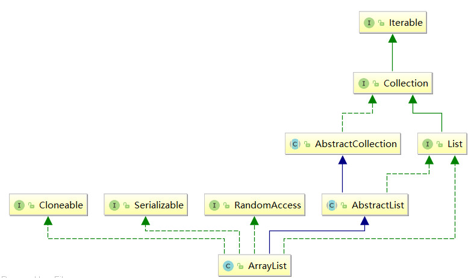

* [概述](#%E6%A6%82%E8%BF%B0)
* [数据结构](#%E6%95%B0%E6%8D%AE%E7%BB%93%E6%9E%84)
* [源码分析](#%E6%BA%90%E7%A0%81%E5%88%86%E6%9E%90)
  * [继承关系](#%E7%BB%A7%E6%89%BF%E5%85%B3%E7%B3%BB)
  * [属性](#%E5%B1%9E%E6%80%A7)
  * [构造方法](#%E6%9E%84%E9%80%A0%E6%96%B9%E6%B3%95)
  * [核心方法](#%E6%A0%B8%E5%BF%83%E6%96%B9%E6%B3%95)
    * [添加(核心)](#%E6%B7%BB%E5%8A%A0%E6%A0%B8%E5%BF%83)
    * [删除](#%E5%88%A0%E9%99%A4)
  * [set](#set)
  * [indexOf](#indexof)
  * [get](#get)
* [总结](#%E6%80%BB%E7%BB%93)

### 概述

1. 底层数组结构，随机访问具有常量时间。推荐使用for循环遍历。

2. `ArrayList`是可以动态增长和缩减的索引序列，是基于数组实现的`List`类。

3. 该类封装了一个`Object[]`数组，每个类对象都有一个`capacity`属性，表示它们所封装的`object []`数组的长度，当向`ArrayList`中添加元素时，该属性值会自动增加。

   如果向`ArrayList`中添加大量元素，可以使用`ensureCapacity`方法一次性增加`capacity`，可以减少重新分配的次数提高性能。

4. `ArrayList`的用法和`Vector`向量类似，但是`Vector`是一个较老的集合，具有很多缺点，不建议使用，两者区别是：`ArrayList`线程不安全，当多条线程访问同一个`ArrayList`集合时，程序需要手动保证集合的同步性，而`Vector`是线程安全的，但性能低。

5. 继承结构图：

   


### 数据结构

- 底层数据结构就是数组，元素类型为`Object`类型，可以存放所有类型数据。

### 源码分析

#### 继承关系

 1. 继承`AbstractList`,`AbstractList`先实现`List<E>`，而不是让`ArrayList`直接实现`List<E>`：

    接口中全都是抽象的方法，而抽象类中可以有抽象方法，还可以有具体的实现方法，正是利用了这一点，让`AbstractList`实现接口中一些通用的方法，而具体的类如`ArrayList`就继承这个`AbstractList`类，拿到一些通用的方法，然后自己在实现一些自己特有的方法，这样一来，让代码更简洁，把继承结构最底层的类中通用的方法都抽取出来，先一起实现了，减少重复代码。

2. 实现`List<E>`接口：父类`AbstractList`已经实现了这个接口，子类可以不实现，这其实是一个mistake，因为他写这代码的时候觉得这个会有用处，但是其实并没什么用，但因为没什么影响，就一直留到了现在。

3. 实现`RandomAccess`接口：这个是一个标记性接口，它的作用就是用来快速随机存取，有关效率的问题，在实现了该接口的话，那么使用普通的for循环来遍历，性能更高，例如`ArrayList`。而没有实现该接口的话，使用Iterator来迭代，这样性能更高，例如`LinkedList`。所以这个标记性只是为了让我们知道我们用什么样的方式去获取数据性能更好。

4. `Cloneable`接口：实现了该接口，就可以使用`Object.Clone()`方法了。

5. `Serializable`接口：实现该序列化接口，表明该类可以被序列化，即能够从类变成字节流传输，然后还能从字节流变成原来的类。

#### 属性

```java
	/** 版本号 */
	private static final long serialVersionUID = 8683452581122892189L;

    /** 默认容量 */
    private static final int DEFAULT_CAPACITY = 10;

    /** 用无参构造的共享空数组实例。 */
    private static final Object[] EMPTY_ELEMENTDATA = {};

    /**
     * 用于无参构造的实例大小共享空的数组实例。
     * 我们将其与 EMPTY_ELEMENTDATA 区分开来，以了解添加第一个元素时应该膨胀多少。
     */
    private static final Object[] DEFAULTCAPACITY_EMPTY_ELEMENTDATA = {};

    /**
     * 存储元素的数组缓冲区
     * 这个缓冲区数组的长度就是ArrayList的容量 
     * Any empty ArrayList with elementData == DEFAULTCAPACITY_EMPTY_ELEMENTDATA
     * will be expanded to DEFAULT_CAPACITY when the first element is added.
     */
    transient Object[] elementData; // non-private to simplify nested class access

    /** ArrayList的大小(the number of elements it contains) */
    private int size;
    /**
     * 数组最大可分配的大小。数组作为一个对象，需要一定的内存存储对象头信息，对象头信息最大占用内存不可		* 超过8字节。
     * Some VMs reserve(保留) some header words in an array.
     * Attempts to allocate larger arrays may result in
     * OutOfMemoryError: Requested array size exceeds(超过) VM limit
     */
    private static final int MAX_ARRAY_SIZE = Integer.MAX_VALUE - 8;
```

#### 构造方法

```java
    /** 指定初始化容量构造一个空的list */
    public ArrayList(int initialCapacity) {
        if (initialCapacity > 0) {
            this.elementData = new Object[initialCapacity];
        } else if (initialCapacity == 0) {
            this.elementData = EMPTY_ELEMENTDATA;
        } else {
            throw new IllegalArgumentException("Illegal Capacity: "+
                                               initialCapacity);
        }
    }

    /** 初始容量为10(DEFAULT CAPACITY)的构造 */
    public ArrayList() {
        this.elementData = DEFAULTCAPACITY_EMPTY_ELEMENTDATA;
    }

    /**
     * 构造一个包含指定集合的元素的list
     * 返回的顺序与这个集合的迭代器返回的顺序一致
	 */
    public ArrayList(Collection<? extends E> c) {
        elementData = c.toArray();
        if ((size = elementData.length) != 0) {
            // c.toArray might (incorrectly) not return Object[] (see 6260652)
            if (elementData.getClass() != Object[].class)
                elementData = Arrays.copyOf(elementData, size, Object[].class);
        } else {
            // replace with empty array.
            this.elementData = EMPTY_ELEMENTDATA;
        }
    }

```

#### 核心方法

##### 添加(核心)    

   ```java
       /**
        * 将指定元素添加到list的末尾
        *
        * 大概思路：在size+1和默认容量10中取较大(可能size为0)的为minCapacity，如果minCapacity<	 
        * 当前容量，什么也不做，如果minCapacity>当前容量,将当前容量扩容1.5倍，扩容后再比较，如果扩			* 容后，minCapacity还是大，就以minCapacity为新容量，否则以1.5倍当前容量为新容量，如果新	
        * 容量大于最大可分配容量(整型最大值-8)，就以整型最大值为新容量(超过这就会报OutOfMemory)，	 
        * 这时新数组大小已经确定，将原数组中数据拷贝到一个新数组即可。
        */
       public boolean add(E e) {
           ///确定内部容量是否足够。保证size+1个元素不会越界
           ensureCapacityInternal(size + 1);  // 修改次数要+1
           elementData[size++] = e;
           return true;
       }
   	   /**
        * Internal：内部的
        */
       private void ensureCapacityInternal(int minCapacity) {
           ensureExplicitCapacity(calculateCapacity(elementData, minCapacity));
       }
   
       /**
        * 如果对象数组为空数组，就取10与minCapacity两个中较大的那个
        * 如果对象数组不为空数组，就取minCapacity
        */
       private static int calculateCapacity(Object[] elementData, int minCapacity) {
           if (elementData == DEFAULTCAPACITY_EMPTY_ELEMENTDATA) {
               return Math.max(DEFAULT_CAPACITY, minCapacity);
           }
           return minCapacity;
       }
   
   	   /**
        * Explicit：不含糊的，直接的
        */
       private void ensureExplicitCapacity(int minCapacity) {
           //修改次数+1
           modCount++;
           // overflow-conscious code
           //最小容量大于当前长度
           if (minCapacity - elementData.length > 0)
               //增长
               grow(minCapacity);
       }
       private void grow(int minCapacity) {
           //oldCapacity为数组长度
           int oldCapacity = elementData.length;
           //newCapacity为1.5倍oldCapacity
           int newCapacity = oldCapacity + (oldCapacity >> 1);
           //如果newCapacity还是<参数minCapacity，newCapacity就等于参数minCapacity
           if (newCapacity - minCapacity < 0)
               newCapacity = minCapacity;
   //如果newCapacity>最大能分配的容量(Integer.MAX_VALUE -8),newCapacity=Integer.MAX_VALUE
           if (newCapacity - MAX_ARRAY_SIZE > 0)
               newCapacity = hugeCapacity(minCapacity);
           elementData = Arrays.copyOf(elementData, newCapacity);
       }
   	   /**
        * 如果minCapacity<Integer.MAX_VALUE - 8,返回Integer.MAX_VALUE - 8
        * 如果minCapacity>Integer.MAX_VALUE - 8，返回Integer.MAX_VALUE
        */
       private static int hugeCapacity(int minCapacity) {
           if (minCapacity < 0) // overflow
               throw new OutOfMemoryError();
           return (minCapacity > MAX_ARRAY_SIZE) ?
            Integer.MAX_VALUE :MAX_ARRAY_SIZE;
       }
   
       /**
        * 在指定位置插入元素，将这个位置右面的元素(如果存在)右移
        */
       public void add(int index, E element) {
           rangeCheckForAdd(index);
   		//与上面一样，保证size+1个元素不会越界。
           ensureCapacityInternal(size + 1);  // 修改次数+1
           //将elementData从index起的size-index个元素复制到elementData中，从elementData的
           //第index+1位置开始复制
           System.arraycopy(elementData, index, elementData, index + 1,size - index);
           elementData[index] = element;
           size++;
       }
   	   /** 确保指定的位置合法 */
       private void rangeCheckForAdd(int index) {
           if (index > size || index < 0)
               throw new IndexOutOfBoundsException(outOfBoundsMsg(index));
       }
   
       /**
        * 将指定集合中的所有元素添加到list的末尾，添加的顺序与这个集合的迭代器顺序一致。当这个操作正
        * 在进行时，如果修改这个集合，可能发生不确定的行为。也就是说，如果这个指定集合是list本身，那么
        * 这个调用的行为就是不确定的。
   	    */
       public boolean addAll(Collection<? extends E> c) {
           Object[] a = c.toArray();
           int numNew = a.length;
           //与上面一样，保证size+newNew个元素不会越界。
           ensureCapacityInternal(size + numNew);  // 增加修改次数
           //将a从0起的numNew个元素复制到elementData中，从elementData的size位置开始复制
           System.arraycopy(a, 0, elementData, size, numNew);
           size += numNew;
           return numNew != 0;
       }
   
       /**
        * 将指定集合中的所有元素插入到list中，从指定位置开始插，这个位置右边的元素(如果存在)右移。
        */
       public boolean addAll(int index, Collection<? extends E> c) {
           //确保指定的位置合法，同上
           rangeCheckForAdd(index);
   
           Object[] a = c.toArray();
           int numNew = a.length;
           //与上面一样，保证size+newNew个元素不会越界。
           ensureCapacityInternal(size + numNew);  // 增加修改次数
   		   //要移动的元素个数
           int numMoved = size - index;
           if (numMoved > 0)
               //将elementData从index起的numMoved个元素拷贝到elementData中，从index + numNew
               //位置开始拷贝
               System.arraycopy(elementData,index,elementData,index + numNew,numMoved);
           System.arraycopy(a, 0, elementData, index, numNew);
           size += numNew;
           return numNew != 0;
       }
   ```

   

##### 删除

```java
    /** 删除指定位置的元素，将它右边的元素左移 */
    public E remove(int index) {
        //确保指定位置合法
        rangeCheck(index);
        modCount++;//修改次数+1
        E oldValue = elementData(index);
		//要移动的元素个数
        int numMoved = size - index - 1;
        if (numMoved > 0)
            //将elementData从index+1起的numMoved个元素拷贝到elementData中，从index位置开始拷贝
            System.arraycopy(elementData,index+1,elementData,index,numMoved);
        //将最后一个元素置为空，以便gc更快回收它
        elementData[--size] = null; 
		//返回删除的那个元素
        return oldValue;
    }
	/** 确保这个指定的位置合法 */
    private void rangeCheck(int index) {
        if (index >= size)
            throw new IndexOutOfBoundsException(outOfBoundsMsg(index));
    }

    /**
     * 删除指定元素，如果这个元素存在，将第一个遇到的删除，如果不存在，就不改变。更正式的，删除最低索引
     * i的元素，使得o==null?get(i)==null:o.equals(get(i))) (如果元素存在的话)，如果这个list包含指		* 定的元素(或者等效的，如果这个list更改为调用的结果)，则返回true。
     */
    public boolean remove(Object o) {
        if (o == null) {
            for (int index = 0; index < size; index++)
                //第一个o相等的元素
                if (elementData[index] == null) {
                    fastRemove(index);
                    return true;
                }
        } else {
            for (int index = 0; index < size; index++)
                //第一个与o相等的元素
                if (o.equals(elementData[index])) {
                    fastRemove(index);
                    return true;
                }
        }
        //如果指定的元素不存在，返回false，存在，返回true
        return false;
    }
    /** 跳过边界检查并且不会返回删除的那个元素 */
    private void fastRemove(int index) {
        modCount++;//修改次数+1
        //要移动的元素
        int numMoved = size - index - 1;
        if (numMoved > 0)
            //将elementData元素从index+1起的numMovend个元素复制到elementData中，从index位置开始
            System.arraycopy(elementData, index+1, elementData, index,numMoved);
        //将最后一个元素置为空，以便gc更快回收它
        elementData[--size] = null; 
    }
    /** 清空所有元素 */
    public void clear() {
        modCount++;
		//置为null让gc回收
        for (int i = 0; i < size; i++)
            elementData[i] = null;
        //size为0
        size = 0;
    }
    /** 从list中移除包含在指定集合c中的所有元素 */
    public boolean removeAll(Collection<?> c) {
        Objects.requireNonNull(c);
        return batchRemove(c, false);
    }

    private boolean batchRemove(Collection<?> c, boolean complement) {
        final Object[] elementData = this.elementData;
        int r = 0, w = 0;
        boolean modified = false;
        try {
            //r记录读，每次都+1
            //w记录写，只有c中的元素在list中不存在时，才会写
            for (; r < size; r++)
                //如果c中不包含list中的元素，r,w都后移
                //如果c中包含list中的元素，r后移，w不动
                //把需要移除的数据都替换掉，不需要移除的数据前移。
                if (c.contains(elementData[r]) == complement)
                    elementData[w++] = elementData[r];
        } finally {
            //  为了与AbstractCollection兼容，如果c.contains()抛出异常的话
    
            if (r != size) {
                //把elementData从r起的size-r个元素复制到elementData中，从w位置开始复制
                System.arraycopy(elementData,r,elementData,w,size - r);
                w += size - r;
            }
            //即存在元素被删除
            if (w != size) {
                // 置为空让gc回收
                for (int i = w; i < size; i++)
                    elementData[i] = null;
                //修改次数为删除的元素个数
                modCount += size - w;
                //新的size为w
                size = w;
                modified = true;
            }
        }
        return modified;
    }
```

#### set

```java
    /** 指定值替换指定位置的元素 */
    public E set(int index, E element) {
        //确保指定位置合法，同上
        rangeCheck(index);
        E oldValue = elementData(index);
        elementData[index] = element;
        return oldValue;
    }

    @SuppressWarnings("unchecked")
    E elementData(int index) {
        return (E) elementData[index];
    }
```

#### indexOf

```java
    /**
     * 返回list中第一次出现指定元素的索引，如果list中不包含这个元素返回-1
     * 更正式的,返回最小索引i,使(o==null?get(i)==null:o.equals(get(i))),如果没有这个索引，返回-1
     */
    public int indexOf(Object o) {
        if (o == null) {
            for (int i = 0; i < size; i++)
                if (elementData[i]==null)
                    return i;
        } else {
            for (int i = 0; i < size; i++)
                if (o.equals(elementData[i]))
                    return i;
        }
        return -1;
    }
```

#### get

```java
    /** 返回list中指定位置的元素 */
    public E get(int index) {
        //确保指定位置合法，同上
        rangeCheck(index);
        return elementData(index);
    }
```


### 总结

1. `arrayList`可以存放`null`。
2. `arrayList`本质上就是一个`elementData`数组。
3. `arrayList`区别于数组的地方在于能够自动扩展大小，其中关键的方法就是`gorw()`方法。
4. `arrayList`中`removeAll(collection c)`和`clear()`的区别就是`removeAll`可以删除批量指定的元素，而clear是全是删除集合中的元素。
5. `arrayList`由于本质是数组，所以它在数据的查询方面会很快，而在插入删除这些方面，性能下降很多，有移动很多数据才能达到应有的效果
6. `arrayList`实现了`RandomAccess`，所以在遍历它的时候推荐使用for循环，而不是`foreach`。