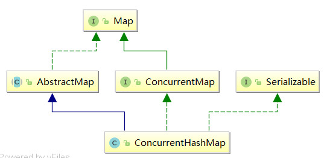

* [弱一致性](#%E5%BC%B1%E4%B8%80%E8%87%B4%E6%80%A7)
* [1\.7](#17)
* [1\.8](#18)
* [源码分析](#%E6%BA%90%E7%A0%81%E5%88%86%E6%9E%90)
  * [内部类](#%E5%86%85%E9%83%A8%E7%B1%BB)
  * [属性](#%E5%B1%9E%E6%80%A7)
  * [构造方法](#%E6%9E%84%E9%80%A0%E6%96%B9%E6%B3%95)
  * [核心方法](#%E6%A0%B8%E5%BF%83%E6%96%B9%E6%B3%95)

### 弱一致性

- 即`put()`一个元素后，`get()`在某段时间内可能还看不到。

- `ConcurrentHashMap`的弱一致性主要是为了提升效率，是一致性与效率之间的一种权衡。要成为强一致性，就得到处使用锁，甚至是全局锁，这就与`Hashtable`和同步的`HashMap`一样了。
- 原因：`get()`是一个无锁操作，因此它和`put`可以同时进行。

### 1.7

- `ConcurrentHashMap` 采用了分段锁技术，其中` Segment `继承于 `ReentrantLock`。不会像 `HashTable` 那样不管是`put`还是`get`操作都需要做同步处理，理论上 `ConcurrentHashMap` 支持` CurrencyLevel` (`Segment` 数组数量)的线程并发。每当一个线程占用锁访问一个 `Segment `时，不会影响到其他的` Segment`。
- 结构还是数组 + 链表。
- 它先定位到`Segment`，然后再进行`put`操作。步骤：
  1. 通过`scanAndLockForPut`自旋获取锁。
  2. 如果重试次数达到了`MAX_SCAN_RETRIES`就改为阻塞获取锁，保证能获取成功。
  3. 根据`key`定位到`HashEntry`，如果`HashEntry`为空就新建一个`HashEntry`加入到`Segment`中，如果不为空就判断`key`是否相等，相等就覆盖，不相等就添加。
- `get()`将 `Key`通过 `Hash `之后定位到具体的 `Segment `，再通过一次 `Hash `定位到具体的元素上。由于 `HashEntry`中的 `value` 属性是用 `volatile` 关键词修饰的，保证了内存可见性，所以每次获取时都是最新值。
- 1.7 已经解决了并发问题，并且能支持 `N` 个 `Segment `这么多次数的并发，但依然存在 `HashMap `在 1.7 版本中的问题。那就是数据结构为数组加链表，查询遍历链表效率太低。

### 1.8 

1. 抛弃了原有的 `Segment` 分段锁，而采用了 `CAS + synchronized` 来保证并发安全性。底层使用数组+链表+红黑树来实现。
  
2. `put()`步骤

   1. 根据`key`计算`hash`值
   2. 判断是否要初始化`Node<K,V>[] table`
   3. 如果`key`定位到的`Node`为空，表示当前位置可以写入数据，利用`cas`尝试写入。
   4. 如果`key`定位到的`Node`的`hashcode == MOVED == -1`,则需要进行扩容。
   5. 如果都不满足，则利用 `synchronized `锁写入数据。
   6. 写入数据后如果数量大于 `TREEIFY_THRESHOLD` 则要转换为红黑树。

3. 为什么不用ReentrantLock，而用synchronized

   - 减少内存开销:如果使用ReentrantLock则需要节点继承AQS来获得同步支持，增加内存开销，而1.8中只有头节点需要进行同步。

   - 内部优化:synchronized则是JVM直接支持的，JVM能够在运行时作出相应的优化措施：锁粗化、锁消除、锁自旋等等。

4. 继承关系

   

### 源码分析

#### 内部类

```java
    /**
     * 主要用于存储具体键值对，其子类有
     * ForwardingNode、ReservationNode、TreeNode和TreeBin 4个
     */
    static class Node<K,V> implements Map.Entry<K,V> {
        final int hash;
        final K key;
        volatile V val;
        volatile Node<K,V> next;

        Node(int hash, K key, V val, Node<K,V> next) {
            this.hash = hash;
            this.key = key;
            this.val = val;
            this.next = next;
        }

        public final K getKey()       { return key; }
        public final V getValue()     { return val; }
        public final int hashCode()   { return key.hashCode() ^ val.hashCode(); }
        public final String toString(){ return key + "=" + val; }
        public final V setValue(V value) {
            throw new UnsupportedOperationException();
        }

        public final boolean equals(Object o) {
            Object k, v, u; Map.Entry<?,?> e;
            return ((o instanceof Map.Entry) &&
                    (k = (e = (Map.Entry<?,?>)o).getKey()) != null &&
                    (v = e.getValue()) != null &&
                    (k == key || k.equals(key)) &&
                    (v == (u = val) || v.equals(u)));
        }

        /**
         * Virtualized support for map.get(); overridden in subclasses.
         */
        Node<K,V> find(int h, Object k) {
            Node<K,V> e = this;
            if (k != null) {
                do {
                    K ek;
                    if (e.hash == h &&
                        ((ek = e.key) == k || (ek != null && k.equals(ek))))
                        return e;
                } while ((e = e.next) != null);
            }
            return null;
        }
    }
    /**
     * 主要用于遍历操作，其子类有BaseIterator、KeySpliterator、ValueSpliterator、          
     * EntrySpliterator四个类，BaseIterator用于遍历操作。KeySplitertor、ValueSpliterator、	
     * EntrySpliterator则用于键、值、键值对的划分。
     */
    static class Traverser<K,V> {
        Node<K,V>[] tab;        // current table; updated if resized
        Node<K,V> next;         // the next entry to use
        TableStack<K,V> stack, spare; // to save/restore on ForwardingNodes
        int index;              // index of bin to use next
        int baseIndex;          // current index of initial table
        int baseLimit;          // index bound for initial table
        final int baseSize;     // initial table size

        Traverser(Node<K,V>[] tab, int size, int index, int limit) {
            this.tab = tab;
            this.baseSize = size;
            this.baseIndex = this.index = index;
            this.baseLimit = limit;
            this.next = null;
        }

        /**
         * Advances if possible, returning next valid node, or null if none.
         */
        final Node<K,V> advance() {
            Node<K,V> e;
            if ((e = next) != null)
                e = e.next;
            for (;;) {
                Node<K,V>[] t; int i, n;  // must use locals in checks
                if (e != null)
                    return next = e;
                if (baseIndex >= baseLimit || (t = tab) == null ||
                    (n = t.length) <= (i = index) || i < 0)
                    return next = null;
                if ((e = tabAt(t, i)) != null && e.hash < 0) {
                    if (e instanceof ForwardingNode) {
                        tab = ((ForwardingNode<K,V>)e).nextTable;
                        e = null;
                        pushState(t, i, n);
                        continue;
                    }
                    else if (e instanceof TreeBin)
                        e = ((TreeBin<K,V>)e).first;
                    else
                        e = null;
                }
                if (stack != null)
                    recoverState(n);
                else if ((index = i + baseSize) >= n)
                    index = ++baseIndex; // visit upper slots if present
            }
        }

        /**
         * Saves traversal state upon encountering a forwarding node.
         */
        private void pushState(Node<K,V>[] t, int i, int n) {
            TableStack<K,V> s = spare;  // reuse if possible
            if (s != null)
                spare = s.next;
            else
                s = new TableStack<K,V>();
            s.tab = t;
            s.length = n;
            s.index = i;
            s.next = stack;
            stack = s;
        }

        /**
         * Possibly pops traversal state.
         *
         * @param n length of current table
         */
        private void recoverState(int n) {
            TableStack<K,V> s; int len;
            while ((s = stack) != null && (index += (len = s.length)) >= n) {
                n = len;
                index = s.index;
                tab = s.tab;
                s.tab = null;
                TableStack<K,V> next = s.next;
                s.next = spare; // save for reuse
                stack = next;
                spare = s;
            }
            if (s == null && (index += baseSize) >= n)
                index = ++baseIndex;
        }
    }

    /**
     * 主要定义了视图操作，其子类KeySetView、ValueSetView、EntrySetView分别表示键视图、值视图、键值 
     * 对视图。对视图均可以进行操作。
     */
    abstract static class CollectionView<K,V,E>
        implements Collection<E>, java.io.Serializable {
        private static final long serialVersionUID = 7249069246763182397L;
        final ConcurrentHashMap<K,V> map;
        CollectionView(ConcurrentHashMap<K,V> map)  { this.map = map; }

        /**
         * Returns the map backing this view.
         *
         * @return the map backing this view
         */
        public ConcurrentHashMap<K,V> getMap() { return map; }

        /**
         * Removes all of the elements from this view, by removing all
         * the mappings from the map backing this view.
         */
        public final void clear()      { map.clear(); }
        public final int size()        { return map.size(); }
        public final boolean isEmpty() { return map.isEmpty(); }

        // implementations below rely on concrete classes supplying these
        // abstract methods
        /**
         * Returns an iterator over the elements in this collection.
         *
         * <p>The returned iterator is
         * <a href="package-summary.html#Weakly"><i>weakly consistent</i></a>.
         *
         * @return an iterator over the elements in this collection
         */
        public abstract Iterator<E> iterator();
        public abstract boolean contains(Object o);
        public abstract boolean remove(Object o);

        private static final String oomeMsg = "Required array size too large";

        public final Object[] toArray() {
            long sz = map.mappingCount();
            if (sz > MAX_ARRAY_SIZE)
                throw new OutOfMemoryError(oomeMsg);
            int n = (int)sz;
            Object[] r = new Object[n];
            int i = 0;
            for (E e : this) {
                if (i == n) {
                    if (n >= MAX_ARRAY_SIZE)
                        throw new OutOfMemoryError(oomeMsg);
                    if (n >= MAX_ARRAY_SIZE - (MAX_ARRAY_SIZE >>> 1) - 1)
                        n = MAX_ARRAY_SIZE;
                    else
                        n += (n >>> 1) + 1;
                    r = Arrays.copyOf(r, n);
                }
                r[i++] = e;
            }
            return (i == n) ? r : Arrays.copyOf(r, i);
        }

        @SuppressWarnings("unchecked")
        public final <T> T[] toArray(T[] a) {
            long sz = map.mappingCount();
            if (sz > MAX_ARRAY_SIZE)
                throw new OutOfMemoryError(oomeMsg);
            int m = (int)sz;
            T[] r = (a.length >= m) ? a :
                (T[])java.lang.reflect.Array
                .newInstance(a.getClass().getComponentType(), m);
            int n = r.length;
            int i = 0;
            for (E e : this) {
                if (i == n) {
                    if (n >= MAX_ARRAY_SIZE)
                        throw new OutOfMemoryError(oomeMsg);
                    if (n >= MAX_ARRAY_SIZE - (MAX_ARRAY_SIZE >>> 1) - 1)
                        n = MAX_ARRAY_SIZE;
                    else
                        n += (n >>> 1) + 1;
                    r = Arrays.copyOf(r, n);
                }
                r[i++] = (T)e;
            }
            if (a == r && i < n) {
                r[i] = null; // null-terminate
                return r;
            }
            return (i == n) ? r : Arrays.copyOf(r, i);
        }

        /**
         * Returns a string representation of this collection.
         * The string representation consists of the string representations
         * of the collection's elements in the order they are returned by
         * its iterator, enclosed in square brackets ({@code "[]"}).
         * Adjacent elements are separated by the characters {@code ", "}
         * (comma and space).  Elements are converted to strings as by
         * {@link String#valueOf(Object)}.
         *
         * @return a string representation of this collection
         */
        public final String toString() {
            StringBuilder sb = new StringBuilder();
            sb.append('[');
            Iterator<E> it = iterator();
            if (it.hasNext()) {
                for (;;) {
                    Object e = it.next();
                    sb.append(e == this ? "(this Collection)" : e);
                    if (!it.hasNext())
                        break;
                    sb.append(',').append(' ');
                }
            }
            return sb.append(']').toString();
        }

        public final boolean containsAll(Collection<?> c) {
            if (c != this) {
                for (Object e : c) {
                    if (e == null || !contains(e))
                        return false;
                }
            }
            return true;
        }

        public final boolean removeAll(Collection<?> c) {
            if (c == null) throw new NullPointerException();
            boolean modified = false;
            for (Iterator<E> it = iterator(); it.hasNext();) {
                if (c.contains(it.next())) {
                    it.remove();
                    modified = true;
                }
            }
            return modified;
        }

        public final boolean retainAll(Collection<?> c) {
            if (c == null) throw new NullPointerException();
            boolean modified = false;
            for (Iterator<E> it = iterator(); it.hasNext();) {
                if (!c.contains(it.next())) {
                    it.remove();
                    modified = true;
                }
            }
            return modified;
        }

    }
    /**
     * 在JDK1.8中与之前的版本的JDK作用存在很大的差别，JDK1.8下，其在普通的ConcurrentHashMap操作中已
     * 经没有失效，其在序列化与反序列化的时候会发挥作用。
     */
    static class Segment<K,V> extends ReentrantLock implements Serializable {
        private static final long serialVersionUID = 2249069246763182397L;
        final float loadFactor;
        Segment(float lf) { this.loadFactor = lf; }
    }
    /**
     * 主要用于对baseCount的计数。
     */
    @sun.misc.Contended static final class CounterCell {
        volatile long value;
        CounterCell(long x) { value = x; }
    }
```


#### 属性

```java
    private static final long serialVersionUID = 7249069246763182397L;
    
	/** 最大容量 */
    private static final int MAXIMUM_CAPACITY = 1 << 30;

    /** 默认容量 */
    private static final int DEFAULT_CAPACITY = 16;

    /** 最大数组大小 */
    static final int MAX_ARRAY_SIZE = Integer.MAX_VALUE - 8;

    /** 默认并发数 */
    private static final int DEFAULT_CONCURRENCY_LEVEL = 16;

    /** 加载因子 */
    private static final float LOAD_FACTOR = 0.75f;

    /** 转化为红黑树的阈值 */
    static final int TREEIFY_THRESHOLD = 8;

    /** 红黑树转换为链表的阈值 */
    static final int UNTREEIFY_THRESHOLD = 6;

    /** 转化为红黑树的表的最小容量 */
    static final int MIN_TREEIFY_CAPACITY = 64;

    /** 每次进行位移的最小值 */
    private static final int MIN_TRANSFER_STRIDE = 16;

    /** 生成sizeCtl所使用的bit位数 */
    private static int RESIZE_STAMP_BITS = 16;

    /** 进行扩容所允许的最大线程数 */
    private static final int MAX_RESIZERS = (1 << (32 - RESIZE_STAMP_BITS)) - 1;

    /** 记录sizeCtl中的大小所需要进行的偏移位数 */
    private static final int RESIZE_STAMP_SHIFT = 32 - RESIZE_STAMP_BITS;

    /** 一系列标识 */
    static final int MOVED     = -1; // hash for forwarding nodes
    static final int TREEBIN   = -2; // hash for roots of trees
    static final int RESERVED  = -3; // hash for transient reservations
    static final int HASH_BITS = 0x7fffffff; // usable bits of normal node hash

    /** 获取可用CPU的个数 */
    static final int NCPU = Runtime.getRuntime().availableProcessors();

    /** 进行序列化的属性 */
    private static final ObjectStreamField[] serialPersistentFields = {
        new ObjectStreamField("segments", Segment[].class),
        new ObjectStreamField("segmentMask", Integer.TYPE),
        new ObjectStreamField("segmentShift", Integer.TYPE)
    };

    /** 表，长度总是2的n次幂 */
    transient volatile Node<K,V>[] table;

    /** 下一个表 */
    private transient volatile Node<K,V>[] nextTable;

    /**
     * Base counter value, used mainly when there is no contention,
     * but also as a fallback during table initialization
     * races. Updated via CAS.
     *
     * 基本计数
     */
    private transient volatile long baseCount;

    /**
     * 对表初始化和扩容控制.  When negative, the
     * table is being initialized or resized: -1 for initialization,
     * else -(1 + the number of active resizing threads).  Otherwise,
     * when table is null, holds the initial table size to use upon
     * creation, or 0 for default. After initialization, holds the
     * next element count value upon which to resize the table.
     */
    private transient volatile int sizeCtl;

    /**
     * The next table index (plus one) to split while resizing.
     */
    private transient volatile int transferIndex;

    /**
     * Spinlock (locked via CAS) used when resizing and/or creating CounterCells.
     * 旋转锁
     */
    private transient volatile int cellsBusy;

    /**
     * counter cell表， When non-null, size is a power of 2.
     */
    private transient volatile CounterCell[] counterCells;

    // views
    private transient KeySetView<K,V> keySet;
    private transient ValuesView<K,V> values;
    private transient EntrySetView<K,V> entrySet;

    // Unsafe mechanics
    private static final sun.misc.Unsafe U;
    private static final long SIZECTL;
    private static final long TRANSFERINDEX;
    private static final long BASECOUNT;
    private static final long CELLSBUSY;
    private static final long CELLVALUE;
    private static final long ABASE;
    private static final int ASHIFT;
    static {
        try {
            U = sun.misc.Unsafe.getUnsafe();
            Class<?> k = ConcurrentHashMap.class;
            SIZECTL = U.objectFieldOffset
                (k.getDeclaredField("sizeCtl"));
            TRANSFERINDEX = U.objectFieldOffset
                (k.getDeclaredField("transferIndex"));
            BASECOUNT = U.objectFieldOffset
                (k.getDeclaredField("baseCount"));
            CELLSBUSY = U.objectFieldOffset
                (k.getDeclaredField("cellsBusy"));
            Class<?> ck = CounterCell.class;
            CELLVALUE = U.objectFieldOffset
                (ck.getDeclaredField("value"));
            Class<?> ak = Node[].class;
            ABASE = U.arrayBaseOffset(ak);
            int scale = U.arrayIndexScale(ak);
            if ((scale & (scale - 1)) != 0)
                throw new Error("data type scale not a power of two");
            ASHIFT = 31 - Integer.numberOfLeadingZeros(scale);
        } catch (Exception e) {
            throw new Error(e);
        }
    }
```

#### 构造方法

```java
    /** 创建一个带有默认初始容量 (16)、加载因子 (0.75) 和 concurrencyLevel (16) 的新的空map。 */
    public ConcurrentHashMap() {
    }

    /** 创建一个带有指定初始容量、默认加载因子 (0.75) 和 concurrencyLevel (16) 的新的空map。*/
    public ConcurrentHashMap(int initialCapacity) {
        if (initialCapacity < 0)
            throw new IllegalArgumentException();
        int cap = ((initialCapacity >= (MAXIMUM_CAPACITY >>> 1)) ?
                   MAXIMUM_CAPACITY :
                   tableSizeFor(initialCapacity + (initialCapacity >>> 1) + 1));
        this.sizeCtl = cap;
    }

    /** 创建一个与给定map有相同映射关系的map */
    public ConcurrentHashMap(Map<? extends K, ? extends V> m) {
        this.sizeCtl = DEFAULT_CAPACITY;
        putAll(m);
    }

    /** 创建一个带有指定初始容量、加载因子和默认 concurrencyLevel (1) 的新的空map。*/
    public ConcurrentHashMap(int initialCapacity, float loadFactor) {
        this(initialCapacity, loadFactor, 1);
    }

    /** 创建一个带有指定初始容量、加载因子和并发级别的新的空map。*/
    public ConcurrentHashMap(int initialCapacity,float loadFactor, int concurrencyLevel){
        if (!(loadFactor > 0.0f) || initialCapacity < 0 || concurrencyLevel <= 0)
            throw new IllegalArgumentException();
        if (initialCapacity < concurrencyLevel)   // Use at least as many bins
            initialCapacity = concurrencyLevel;   // as estimated threads
        long size = (long)(1.0 + (long)initialCapacity / loadFactor);
        int cap=(size >=(long)MAXIMUM_CAPACITY)?MAXIMUM_CAPACITY:tableSizeFor((int)size);
        this.sizeCtl = cap;
    }
```

#### 核心方法

```java
    /**
     * 根据 key 计算出 hashcode 。
	 * 判断是否需要进行初始化。
     * f 即为当前 key 定位出的 Node，如果为空表示当前位置可以写入数据，利用 CAS 尝试写入，失败则自旋保		* 证成功。
	 * 如果当前位置的 hashcode == MOVED == -1,则需要进行扩容。
	 * 如果都不满足，则利用 synchronized 锁写入数据。
	 * 如果数量大于 TREEIFY_THRESHOLD 则要转换为红黑树。
     * 
     * 1.8 在 1.7 的数据结构上做了大的改动，采用红黑树之后可以保证查询效率（O(logn)），甚至取消了 	
     * ReentrantLock 改为了 synchronized，这样可以看出在新版的 JDK 中对 synchronized 优化是很到位		* 的。
     */
	final V putVal(K key, V value, boolean onlyIfAbsent) {
        if (key == null || value == null) throw new NullPointerException();
        //计算hash值
        int hash = spread(key.hashCode());
        int binCount = 0;
        //无限循环
        for (Node<K,V>[] tab = table;;) {
            Node<K,V> f; int n, i, fh;
            //表为空或长度为0就初始化
            if (tab == null || (n = tab.length) == 0)
                tab = initTable();
            //指定位置为空
            else if ((f = tabAt(tab, i = (n - 1) & hash)) == null) {
                //cas判断指定位置是否为空，如tab的第i项为空则用新生成的node替换
                if(casTabAt(tab,i,null,new Node<K,V>(hash,key,value,null)))
                    break;                   // no lock when adding to empty bin
            }
            //节点的hash值为MOVED，即正在扩容
            else if ((fh = f.hash) == MOVED)
                //// 进行结点的转移（在扩容的过程中）
                tab = helpTransfer(tab, f);
            //指定位置不为空
            else {
                V oldVal = null;
                // 加锁同步,Java8 摒弃了Segment，而是对数组中单个位置加锁。当指定位置节点不为 null 
                // 时，情况与 Java8 HashMap 操作类似，新节点的添加还是尾部插入方式。
                synchronized (f) {
                    //找到table表下标为i的节点
                    if (tabAt(tab, i) == f) {
                        // 节点是链表情况
                        if (fh >= 0) {
                            binCount = 1;
                            //遍历整个链表
                            for (Node<K,V> e = f;; ++binCount) {
                                K ek;
                                //如果已存在，替换原值
                                if (e.hash == hash &&
                                    ((ek = e.key) == key ||
                                     (ek != null && key.equals(ek)))) {
                                    oldVal = e.val;
                                    if (!onlyIfAbsent)
                                        // 将指定的value保存至结点，即进行了结点值的更新
                                        e.val = value;
                                    break;
                                }
                                Node<K,V> pred = e;
                                // 当前结点的下一个结点为空，即为最后一个结点，则以尾部插入实现添加
                                if ((e = e.next) == null) {
                                    pred.next = new Node<K,V>(hash,key,value,null);
                                    break;
                                }
                            }
                        }
                        // 结点为红黑树结点类型
                        else if (f instanceof TreeBin) {
                            Node<K,V> p;
                            binCount = 2;
                            //遍历红黑树
                            if ((p=((TreeBin<K,V>)f).putTreeVal(hash,key,value))!=null){
                                oldVal = p.val;
                                if (!onlyIfAbsent)
                                    p.val = value;
                            }
                        }
                    }
                }
                if (binCount != 0) {
                    // 如果binCount大于等于转化为红黑树的阈值
                    if (binCount >= TREEIFY_THRESHOLD)
                        // 进行转化
                        treeifyBin(tab, i);
                    if (oldVal != null)
                        // 返回旧值
                        return oldVal;
                    break;
                }
            }
        }
        addCount(1L, binCount);
        return null;
    }

	/**
	 * put方法并没有加锁，那么它是如何保证创建新表的时候并发安全呢？答案就是这里的 sizeCtl ，sizeCtl 	 * 默认值为0，当一个线程初始化数组时，会将 sizeCtl 改成 -1，由于被 volatile 修饰，对于其他线程来
	 * 说这个变化是可见的，上面代码看到后续线程判断 sizeCtl 小于0 就会让出执行权。
 	 */
    private final Node<K,V>[] initTable() {
        Node<K,V>[] tab; int sc;
        while ((tab = table) == null || tab.length == 0) {
            // sizeCtl小于0，当前线程让出执行权
            if ((sc = sizeCtl) < 0)
                Thread.yield(); // lost initialization race; just spin
            //CAS 操作将 sizeCtl 值改为-1
            else if (U.compareAndSwapInt(this, SIZECTL, sc, -1)) {
                try {
                    //默认创建大小为16的数组
                    if ((tab = table) == null || tab.length == 0) {
                        int n = (sc > 0) ? sc : DEFAULT_CAPACITY;
                        @SuppressWarnings("unchecked")
                        Node<K,V>[] nt = (Node<K,V>[])new Node<?,?>[n];
                        table = tab = nt;
                        sc = n - (n >>> 2);
                    }
                } finally {
                    //初始化完后再改回来
                    sizeCtl = sc;
                }
                break;
            }
        }
        return tab;
    }

    public V get(Object key) {
        Node<K,V>[] tab; Node<K,V> e, p; int n, eh; K ek;
        //根据key计算hash值
        int h = spread(key.hashCode());
        //table不为null,table的length>0,hash值对应索引位不为null
        //即存在这个节点，就取，否则返回null
        if ((tab = table) != null && (n = tab.length) > 0 &&
            (e = tabAt(tab, (n - 1) & h)) != null) {
            if ((eh = e.hash) == h) {
                if ((ek = e.key) == key || (ek != null && key.equals(ek)))
                    return e.val;
            }
            else if (eh < 0)
                return (p = e.find(h, key)) != null ? p.val : null;
            while ((e = e.next) != null) {
                if (e.hash == h &&
                    ((ek = e.key) == key || (ek != null && key.equals(ek))))
                    return e.val;
            }
        }
        return null;
    }
```

