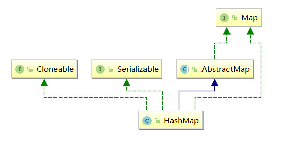
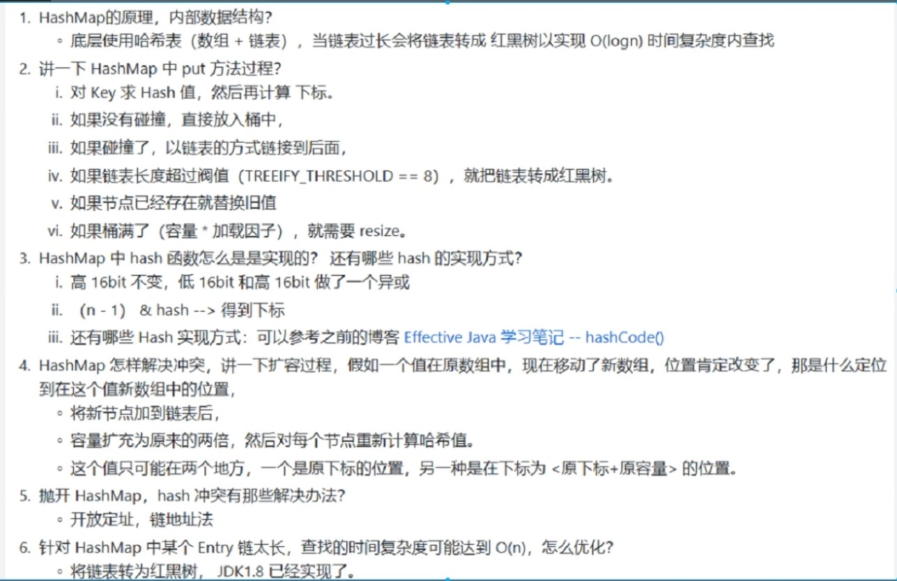

* [前言](#%E5%89%8D%E8%A8%80)
  * [静态查找](#%E9%9D%99%E6%80%81%E6%9F%A5%E6%89%BE)
  * [动态查找](#%E5%8A%A8%E6%80%81%E6%9F%A5%E6%89%BE)
  * [哈希查找](#%E5%93%88%E5%B8%8C%E6%9F%A5%E6%89%BE)
* [概述](#%E6%A6%82%E8%BF%B0)
* [源码分析](#%E6%BA%90%E7%A0%81%E5%88%86%E6%9E%90)
  * [属性](#%E5%B1%9E%E6%80%A7)
  * [内部类](#%E5%86%85%E9%83%A8%E7%B1%BB)
  * [构造方法](#%E6%9E%84%E9%80%A0%E6%96%B9%E6%B3%95)

### 前言

#### 静态查找

- 静态查找指在数据元素集合中查找是否存在关键字等于某个给定关键字的元素。  

- 静态查找的存储结构有：
  - 顺序表
    - 从一端开始，用给定元素的关键字逐个与表中各元素相比较。

  - 有序顺序表
    - 顺序查找
    - 二分查找

  - 索引顺序表

#### 动态查找

- 动态查找指查找过程中，同时插入不存在元素或删除已存在的元素，即数据元素集合可能会改变。

- 动态查找存储结构：

  - 二叉树结构：二叉排序树、平衡二叉树

  - 树结构：B树、B+树

#### 哈希查找

- 既适用于静态查找，也适用于动态查找。存储结构：哈希表(散列表)。

- 哈希函数构造方法：
  - 除留余数法
    - 比如数据元素有n个，哈希表长度为`1.1n-1.7n`之间的一个素数。

  - 直接定址法
    - 数据元素+某个常量C作为哈希地址。不会有哈希冲突，但浪费空间。

  - 数字分析法
     - 取数据元素中某些取值比较均匀的数字位作为哈希地址。只适用于所有关键字值已知。

- 哈希冲突解决方法：
  - 开放定址法
    - 线性探查法
      - 即从发生冲突的地址(d)开始，依次探查下一个地址(d+1,d+2...)。
    - 平方探查法
      - 即从发生冲突的地址(d)开始，依次探查(d+2^0,d+2^1,d+2^2...)
    - 伪随机数法
      - 取一个随机数序列3,33,55...，从发生冲突的地址(d)开始，依次探查(d+3,d+33,d+55...)

  - 链表法
    - 基本思想：如果没有发生冲突，直接存放数据元素；如果发生冲突,把发生冲突的元素存放到链表中。

### 概述

1. `HashMap`基于哈希表的`Map`接口实现，是以`key-value`存储形式存在。（除了**不同步**和**允许使用 null **之外，`HashMap `类与 `Hashtable` 大致相同。)

2. `HashMap` 的实现不是同步的，这意味着它不是线程安全的。它的`key`、`value`都可以为`null`。此外，`HashMap`中的映射不是有序的。在 `jdk1.8`中，`HashMap` 是由 数组+链表+红黑树构成，新增了红黑树作为底层数据结构，结构变得复杂了，但是效率也变的更高效。

3. 当一个值中要存储到`Map`的时候会根据`Key`的值来计算出他的`hash`，通过`hash`来确认到数组的位置，如果发生哈希碰撞就以链表的形式存储，但是这样如果链表过长来的话，`HashMap`会把这个链表转换成红黑树来存储。

4. 继承关系图

    

### 源码分析

#### 属性

```java
    /** 序列化id */
    private static final long serialVersionUID = 362498820763181265L;

    /** 初始化容量，必须是2的n次幂，默认为16 */
    static final int DEFAULT_INITIAL_CAPACITY = 1 << 4; // aka 16

    /** 最大容量,必须是2的n次幂 */
    static final int MAXIMUM_CAPACITY = 1 << 30;

    /** 负载因子，默认0.75 */
    static final float DEFAULT_LOAD_FACTOR = 0.75f;

    /** treeify_threshold 当链表的元素超过8个就会转为红黑树 */
    static final int TREEIFY_THRESHOLD = 8;

    /** untreeify_threshold 当红黑树节点小于6就会转回链表 */
    static final int UNTREEIFY_THRESHOLD = 6;

    /**
     * 当Map里面的数量超过这个值时，表中的桶才能进行树形化 ，否则桶内元素太多时会扩容，而不是树形化 为了	   * 避免进行扩容、树形化选择的冲突，这个值不能小于 4 * TREEIFY_THRESHOLD
     */
    static final int MIN_TREEIFY_CAPACITY = 64;

    /** 长度为2的n次幂 */
    transient Node<K,V>[] table;

    /** 放缓存 */
    transient Set<Map.Entry<K,V>> entrySet;

    /** map中存储的键值对实时数量 */
    transient int size;

    /** 修改次数 */
    transient int modCount;

    /** 下一个容量值：capacity * load factor，超过这个阈值就扩容 */
    int threshold;

    /** hash表加载因子 */
    final float loadFactor;
```

#### 内部类

```java
    /** 基本节点(无树) */
    static class Node<K,V> implements Map.Entry<K,V> {
        //4个属性
        final int hash;
        final K key;
        V value;
        Node<K,V> next;

        Node(int hash, K key, V value, Node<K,V> next) {
            this.hash = hash;
            this.key = key;
            this.value = value;
            this.next = next;
        }

        public final K getKey()        { return key; }
        public final V getValue()      { return value; }
        public final String toString() { return key + "=" + value; }

        public final int hashCode() {
            return Objects.hashCode(key) ^ Objects.hashCode(value);
        }
		//返回旧节点值
        public final V setValue(V newValue) {
            V oldValue = value;
            value = newValue;
            return oldValue;
        }
		//如果是同一对象，一定相等
        //如果不是同一对象，再比较每一对key和value
        public final boolean equals(Object o) {
            if (o == this)
                return true;
            if (o instanceof Map.Entry) {
                Map.Entry<?,?> e = (Map.Entry<?,?>)o;
                if (Objects.equals(key, e.getKey()) &&
                    Objects.equals(value, e.getValue()))
                    return true;
            }
            return false;
        }
    }
```


#### 构造方法

```java
    /** 指定initial capacity和loadFactor构造空的HashMap */
    public HashMap(int initialCapacity, float loadFactor) {
        if (initialCapacity < 0)
            throw new IllegalArgumentException("Illegal initial capacity: " +
                                               initialCapacity);
        if (initialCapacity > MAXIMUM_CAPACITY)
            initialCapacity = MAXIMUM_CAPACITY;
        if (loadFactor <= 0 || Float.isNaN(loadFactor))
            throw new IllegalArgumentException("Illegal load factor: " +
                                               loadFactor);
        this.loadFactor = loadFactor;
        /** 根据初始容量计算下次要扩容的值 */
        this.threshold = tableSizeFor(initialCapacity);
    }

    /** 
     * 返回一个大于等于且最接近 cap 的2的幂次方整数
     * 
     * >>> ：左边操作数右移右边操作数位，不论正负，高位补0
     * | ：同为0才为0
     *
     * 通过几次右移和或操作后，将最高位1后面的位全部变为1。
     * 比如：cap为十进制25，n为25，即 0001 1001，最高位1为第3位
     * n >>> 1 = 0000 1100
     *    0001 1001
     *  |
     *	  0000 1100
     *   ----------
     *    0001 1101
     *
     * 0001 1101 >>> 2 = 0000 0111
     * 
     * 	  0001 1101
     *  |
     *    0000 0111
     *   ----------
     *    0001 1111
     *
     * 经过两次运算后，n为 0001 1111,第3位1后面的位全为1，后面再进行运算不会发生变化了。
     *
     * 在使用位运算之前减1是必要的，否则对于cap=16,最后就会得到32.实际需求应当返回16.
     * 
     * int范围在-2^31~2^31-1，因此对于int最大的2次幂数为2^30，这也就是MAXIMUM_CAPACITY的值。c超过      * 这个值就会返回MAXIMUM_CAPACITY。而这边代码中一共右移了1+2+4+8+16=31位，因此可以保证高位1以下      * 的低位都会变成1.
     * 
     * 如果传入的n为负数，经过补码运算后为-1，在return中，如果n<0，会返回1，所有不会有异常
     */
    static final int tableSizeFor(int cap) {
        int n = cap - 1;
        n |= n >>> 1;
        n |= n >>> 2;
        n |= n >>> 4;
        n |= n >>> 8;
        n |= n >>> 16;
        return (n < 0) ? 1 : (n >= MAXIMUM_CAPACITY) ? MAXIMUM_CAPACITY : n + 1;
    }

    /** 指定初始容量，使用默认加载因子 */
    public HashMap(int initialCapacity) {
        this(initialCapacity, DEFAULT_LOAD_FACTOR);
    }

    /** 默认初始容量16，默认加载因子0.75 */
    public HashMap() {
        this.loadFactor = DEFAULT_LOAD_FACTOR; 
    }

    /** 根据指定map创建一个新的HashMap */
    public HashMap(Map<? extends K, ? extends V> m) {
        this.loadFactor = DEFAULT_LOAD_FACTOR;
        putMapEntries(m, false);
    }

    /** 
     * 这个方法是putAll方法和上面这个构造器方法的实现
     * evict：初始构建map时为false，插入节点时为true
     */
    final void putMapEntries(Map<? extends K, ? extends V> m, boolean evict) {
        //获取传入map的长度
        int s = m.size();
        if (s > 0) {
            //如果当前map的table没有初始化
            if (table == null) { 
                //传入map的实际长度s <= threshold = 0.75*capacity，所以ft <= capacity,ft最大会				 //=capacity
                //所以ft就是传入map的capacity
                float ft = ((float)s / loadFactor) + 1.0F;
                //比较capacity与可分配的最大长度
                int t = ((ft < (float)MAXIMUM_CAPACITY) ?(int)ft : MAXIMUM_CAPACITY);
                //根据capacity，计算阈值
                if (t > threshold)
                    threshold = tableSizeFor(t);
            }
            //传入map长度>阈值就扩容
            else if (s > threshold)
                resize();
            //遍历传入map，放到当前map中
            for (Map.Entry<? extends K, ? extends V> e : m.entrySet()) {
                K key = e.getKey();
                V value = e.getValue();
                putVal(hash(key), key, value, false, evict);
            }
        }
    }

    /**
     * hashCode值：是KV对中的K对象的hashCode方法的返回值(若没有重写则默认用Object类的hashCode方法	  * 的生成值)
     * hash值：是在hashCode值的基础上又进行了一步运算后的结果，这个运算过程就是hash方法。
     * 数组下标：根据该hash值和数组长度计算出数组下标，计算公式：hash值  &（数组长度-1）= 下标。
     *
     * 如果key为空，那么hash值置为0。HashMap允许null作为键，虽然这样，因为null的hash值一定是0，而且		 * null==null为真，所以HashMap里面最多只会有一个null键。而且这个null键一定是放在数组的第一个位置	   * 上。但是如果存在hash碰撞，该位置上形成链表了，那么null键对应的节点就不确定在链表中的哪个位置了	 * （取决于插入顺序，并且每次扩容其在链表中的位置都可能会改变）。
     * 
	 * 当h在【0-65535】范围内，h ^ (h >>> 16)==h (因为此时 h >>> 16 全为0)
	 * 当h在【65535-N】范围内，位运算后的结果和h不同
	 * 当h在【-N-0】范围内，位运算后的结果和h也不尽相同
     */
    static final int hash(Object key) {
        int h;
        return (key == null) ? 0 : (h = key.hashCode()) ^ (h >>> 16);
    }
    /**
     * 插入key-value,如果已经存在重复的key-value，就返回原来的value,如果不存在重复的，就返回null
     *
     * 大概思路：根据key求hash值，根据hash值计算在数组中的位置，如果没有发生hash冲突，把key-value构建	   * 成节点放在哈希桶中即可；如果发生了hash冲突，分三种情况，1.如果与数组元素的key相同，替换value值，	 * 2.与红黑树节点冲突，添加到红黑树节点中。3.与数组元素的key不同，也不是红黑树节点，遍历链表，如果没		* 有重复，放到链表末尾，判断是否超过阈值，如果超过要转为红黑树。增加一个节点后，还需要判断是否需要扩		 * 容。如果有重复，就替换value值。返回原来的value值，没有重复就返回空。
     */
    final V putVal(int hash, K key, V value, boolean onlyIfAbsent,boolean evict) {
        //hash数组(hash桶)
        Node<K,V>[] tab; 
        //hash桶中的任一节点,同时也是链表或红黑树的首节点。(可以想象一下数组竖着放，每个数组元素横向都可		//以组成一个链表或者红黑树，数组中的每个元素都是链表或者红黑树的的首节点)
        Node<K,V> p; 
        //n：hash数组长度，i：根据hash及数组长度n计算出来的下标，公式：(n-1)&hash= 下标
        int n, i;
        //如果存储元素的table为空
        if ((tab = table) == null || (n = tab.length) == 0)
            //进行必要字段的初始化,n为初始化之后的hash桶长度
            n = (tab = resize()).length;
        //计算数组下标：根据该hash值和数组长度计算出数组下标，计算公式：(数组长度-1)&hash= 下标。
        //情况一：如果i位置元素p为null，即没有发生哈希冲突，就构建节点并放到i位置
        if ((p = tab[i = (n - 1) & hash]) == null)
            tab[i] = newNode(hash, key, value, null);
        //情况二：如果i位置元素p不为null，即发生哈希冲突
        else {
            //e为临时节点，k存放p节点的key
            Node<K,V> e; K k;
            //第一种：与首节点相等
            //如果新节点的hash与p节点的hash及新节点的key与p节点的key相等或者只是key相等
            if (p.hash == hash &&((k = p.key) == key || (key != null && key.equals(k))))
                //p为重复的节点，暂时用e来保存
                e = p;
            //第二种：如果p节点是红黑树节点，就把新节点插入到红黑树中，
            else if (p instanceof TreeNode)
                //如果插入的节点已存在，就返回该节点(不为null)，用e接收，即如果有重复节点，e为重复节					//点，如果没有重复节点，e为null。该值用来判断put，操作是否成功,如果成功，返回null。
                e = ((TreeNode<K,V>)p).putTreeVal(this, tab, hash, key, value);
            //第三种：不等于首节点，也不是红黑树节点，则为链表节点
            else {
                //遍历链表
                for (int binCount = 0; ; ++binCount) {
                    //找到尾部
                    if ((e = p.next) == null) {
                        //将插入的key-value构建成节点添加到尾部
                        p.next = newNode(hash, key, value, null);
                        //链表添加了一个后，长度增加，需要判断是否转为红黑树
                        if (binCount >= TREEIFY_THRESHOLD - 1) // -1 for 1st
                            treeifyBin(tab, hash);
                        break;
                    }
                    //链表中有重复的key-value，则e为当前重复的节点
                    if(e.hash==hash&&((k=e.key)==key||(key != null && key.equals(k))))
                        break; 
                    p = e;
                }
            }
            //前面三种情况都是用e来表示重复节点，所有e!=null表示存在重复节点
            if (e != null) { 
                V oldValue = e.value;
                //用待插入的值进行覆盖，返回旧值
                if (!onlyIfAbsent || oldValue == null)
                    e.value = value;
                afterNodeAccess(e);
                return oldValue;
            }
        }
        //进行到这里，说明待插入的key-value没有重复的。
        ++modCount;
        //长度++,判断是否大于阈值
        if (++size > threshold)
            resize();
        afterNodeInsertion(evict);
        //添加成功
        return null;
    }

    /**
     * 初始化table或者把table大小扩大一倍
     */
    final Node<K,V>[] resize() {
        Node<K,V>[] oldTab = table;
        //获得原数组的长度
        int oldCap = (oldTab == null) ? 0 : oldTab.length;
        //获得原阈值
        int oldThr = threshold;
        //定义新容量，新阈值
        int newCap, newThr = 0;
        //case一：如果原数组长度>0，即原数组中已经有值
        if (oldCap > 0) {
			//特殊情况，已经超过最大容量，不再扩容，直接返回
            if (oldCap >= MAXIMUM_CAPACITY) {
                threshold = Integer.MAX_VALUE;
                return oldTab;
            }
            //其他情况，扩容两倍，两个条件：新容量要小于最大值，原数组长度也要大于16
            else if ((newCap = oldCap << 1) < MAXIMUM_CAPACITY &&
                     oldCap >= DEFAULT_INITIAL_CAPACITY)
                //阈值为原来的两倍
                newThr = oldThr << 1; 
        }
        //case二：如果原阈值>0，根据构造函数可知：
        // 如果没有指定initialCapacity, 则不会给threshold赋值, 该值被初始化为0
        // 如果指定了initialCapacity, threshold被初始化成大于initialCapacity的最小的2的次幂
        // 所以这里是指：构造时指定了initialCapacity,则用threshold作为table的实际大小
        else if (oldThr > 0) 
            newCap = oldThr;
        //case三：构造时没有指定initialCapacity
        else {               
            // 在默认无参数初始化会有这种情况
            newCap = DEFAULT_INITIAL_CAPACITY;
            newThr = (int)(DEFAULT_LOAD_FACTOR * DEFAULT_INITIAL_CAPACITY);
        }
        //计算指定了initialCapacity情况下的新的 threshold
        if (newThr == 0) {
            float ft = (float)newCap * loadFactor;
            newThr = (newCap < MAXIMUM_CAPACITY && ft < (float)MAXIMUM_CAPACITY ?
                      (int)ft : Integer.MAX_VALUE);
        }
        threshold = newThr;
        //从以上操作我们知道, 初始化HashMap时, 
    	//如果构造函数没有指定initialCapacity, 则table大小为16
    	//如果构造函数指定了initialCapacity, 则table大小为threshold, 即大于指定initialCapacity的		 //最小的2的整数次幂
 
        //从下面开始, 初始化table或者扩容, 实际上都是通过新建一个table来完成的        
        @SuppressWarnings({"rawtypes","unchecked"})
            Node<K,V>[] newTab = (Node<K,V>[])new Node[newCap];
        table = newTab;
        //下面这段就是把原来table里面的值全部搬到新的table里面
        if (oldTab != null) {
            //遍历原数组
            for (int j = 0; j < oldCap; ++j) {
                Node<K,V> e;
                //如果原数组的j位置有元素
                if ((e = oldTab[j]) != null) {
                    //这里注意, table中存放的只是Node的引用, 这里将oldTab[j]=null只是清除旧表的引					 //用, 但是真正的node节点还在, 只是现在由e指向它
                    oldTab[j] = null;
                    //如果j位置元素没有后续元素，即不是链表，不是红黑树，就单单一个节点
                    if (e.next == null)
                        // 就直接将它放到新表的目标位置
                        newTab[e.hash & (newCap - 1)] = e;
                    //如果j位置元素是红黑树节点
                    else if (e instanceof TreeNode)
                        //则拆分树
                        ((TreeNode<K,V>)e).split(this, newTab, j, oldCap);
                    //如果j位置元素是链表节点,同样把链表转移到newCap中
                    else { 
                        //定义4个Node引用，可以分别看做lo链表的头，尾，hi链表的头、尾
                        Node<K,V> loHead = null, loTail = null;
                        Node<K,V> hiHead = null, hiTail = null;
                        Node<K,V> next;
                        //遍历节点：
                        //	do {
    					//		next = e.next;
   						//		 ...
						//	} while ((e = next) != null);
                        //按顺序遍历该存储桶位置上的链表中的节点
                        do {
                            next = e.next;
                            if ((e.hash & oldCap) == 0) {
                                //这个if块里，将e插入lo链表尾部
                                if (loTail == null)
                                    loHead = e;
                                else
                                    loTail.next = e;
                                loTail = e;
                            }
                            else {
                                //这个else块里，将e插入hi链表尾部
                                if (hiTail == null)
                                    hiHead = e;
                                else
                                    hiTail.next = e;
                                hiTail = e;
                            }
                        } while ((e = next) != null);
                        //所以上面这段：我们首先准备了两个链表 lo 和 hi, 然后我们顺序遍历该存储桶上							//的链表的每个节点, 如果 (e.hash & oldCap) == 0, 我们就将节点放入lo链表, 						 //否则, 放入hi链表.
                        
                        //如果lo链表非空, 我们就把整个lo链表放到新table的j位置上				
                        if (loTail != null) {
                            loTail.next = null;
                            newTab[j] = loHead;
                        }
                        //如果hi链表非空, 我们就把整个hi链表放到新table的j+oldCap位置上
                        if (hiTail != null) {
                            hiTail.next = null;
                            newTab[j + oldCap] = hiHead;
                        }
                        //综上, 这段代码的意义就是将原来的链表拆分成两个链表, 并将这两个链表分别放到						 //新的table的 j 位置和 j+oldCap 上, j位置就是原链表在原table中的位置, 拆						//分的标准就是：(e.hash & oldCap) == 0
                        
                        //首先明确三点:
						//	1.oldCap一定是2的整数次幂, 这里假设是2^m
						//	2.newCap是oldCap的两倍, 则会是2^(m+1)
						//	3.hash对数组大小取模(n - 1) & hash 其实就是取hash的低m位
                        //例如:
                        //	我们假设 oldCap = 16, 即 2^4,
						// 	16 - 1=15,二进制表示为 0000 0000 0000 0000 0000 0000 0000 1111
						//	可见除了低4位, 其他位置都是0,则 (16-1) & hash 自然就是取hash值的低4						  //  位,我们假设它为 abcd.
                        
                        //	以此类推, 当我们将oldCap扩大两倍后, 新的index的位置就变成了 (32-1) & 						   //  hash, 其实就是取 hash值的低5位. 那么对于同一个Node, 低5位的值无外乎两						//  种情况:0abcd,1abcd
                        //	其中, 0abcd与原来的index值一致,而1abcd =0abcd +10000=0abcd+oldCap
                    	//  故虽然数组大小扩大了一倍，但是同一个key在新旧table中对应的index却存在一						  //  定联系： 要么一致，要么相差一个 oldCap。
                        
                        //	而新旧index是否一致就体现在hash值的第4位(我们把最低为称作第0位), 怎么拿						   //  到这一位的值呢, 只要:
                        //	hash & 0000 0000 0000 0000 0000 0000 0001 0000
                        //  上式就等效于  hash & oldCap
                        //	故得出结论:
                        // 如果 (e.hash & oldCap) == 0 则该节点在新表的下标位置与旧表一致都为 j
						// 如果 (e.hash & oldCap) == 1 则该节点在新表的下标位置 j + oldCap
                        // 根据这个条件, 我们将原位置的链表拆分成两个链表, 然后一次性将整个链表放到新						  // 的Table对应的位置上.
                    }
                }
            }
        }
        //返回扩容后新数组
        return newTab;
    }
    //创建一个常规(没有树)节点
    Node<K,V> newNode(int hash, K key, V value, Node<K,V> next) {
        return new Node<>(hash, key, value, next);
    }
```

### 面试题

1. 



2. 
   1. `1.7`在扩容`resize（）`过程中，在将旧数组上的数据转移到新数组上时，**转移数据操作 = 按旧链表的正序遍历链表、在新链表的头部依次插入**，即在转移数据、扩容后，容易出现**链表逆序的情况**，此时若（多线程）并发执行 `put()`操作，一旦出现扩容情况，则**容易出现环形链表**，从而在获取数据、遍历链表时形成死循环(`Infinite Loop`)，即死锁的状态。
   2. `1.8`使用的尾插法，就不会出现这个问题。
3. `1.8`引入红黑树解决发生哈希碰撞后链表过长导致索引效率慢的问题。从`O(n)`降为`O(logn)`
   1. 链表转为红黑树的阈值`8`，红黑树转链表阈值为`6`，中间有个差值`7`防止频繁发生转换(假设一个`hashmap`不停插入删除一个元素)。
   2. 阈值是`8`：随机哈希码情况下，加载因子为0.75时，桶中节点的分布频率服从参数为`0.5`的泊松分布，链表中元素个数为8的概率非常小。
4. `1.7`与`1.8`计算存储位置的方式不一样。
   1. `1.7`进行`4`次位运算+`5`次异或运算
   2. `1.8`进行`1`次位运算+`1`次异或运算
5. `1.7`与`1.8`扩容后计算存储位置的方式不一样。
   1. `1.7`是重新计算`key`的存储位置
   2. 1.8对于数组节点是重新计算；如果是红黑树节点就要分割红黑树；如果是链表节点就通过`e.hash & oldCap`得到`hash`新增的那个`bit`，如果为0，就在原位置，如果为1就在原位置 + 旧容量
6. 默认初始大小为什么是`2`的幂
   1. 当大小是`2`的幂时，`hash & (n - 1)`等价于` n % hash`，而`&`比`%`效率高。
7. 初始大小为什么是`16`而不是`8`或`32`；扩容因子为什么是0.75
   1. 初始大小太小扩容就太频繁了，太大又太占空间了。
   2. 扩容因子太小扩容就太频繁了，太大碰撞几率就高了，0.75是冲突几率与空间利用率的平衡。
8. 为什么最小树形化容量(`MIN_TREEIFY_CAPACITY `)是`64`
   1. 容量低于`64`时，哈希碰撞几率较大，这时出现长链表的几率也较大，这时候出现的长链表我们应该选择扩容而避免不必要的树化。
9. 为什么一开始不用树，而要节点到达一定数量后才转为树
   1. 因为`TreeNode`占用空间是普通`Node`的两倍。
10. 为什么`String`、`Integer`等类型适合作`Key`
    1. 它们都是`final`类型，具有不可变性，不会出现`put()`和`get()`时`hashcode`不同的情况
    2. 它们内部已重写了`equals()`和`hashCode()`，不容易出现`hash`值计算错误。
11. `HashMap`中的`key`若为`Object`类型，需要实现哪些方法
    1. `hashCode()`：计算需要存储的数据的存储位置，实现不当导致严重冲突
    2. `equal()`：比较是否已存在相同的`key`，保证`key`在表中的唯一性。
12. 重写`equlals`方法和`hashcode`方法
    1. 为什么重写`equals`方法
       1. `equals`方法默认比较地址，如果我们侧重对象的某个属性，就需要重写`equals`方法。
    2. 重写`equals`方法后为什么重写`hashcode`方法
       1. `jvm`规范规定`equals`方法判断两个对象相等时，`hashcode`方法也必须判断两个对象相等。
       2. 如果重写`equals`方法不重写`hashcode`方法，就可能存在两个对象，通过`equals`方判断是相等的对象，但由于没重写`hashcode`方法，计算得到在`hashmap`中的位置不同，导致`hashmap`中存在相同的多个对象。
13. 为什么用红黑树不用`AVL`树
    1. 红黑树不是完全平衡的，AVL树的旋转比红黑树的旋转更加难以平衡
    2. 它的插入和删除效率要比`AVL`树高
14. 为什么1.7用头插法
    1. 因为头插法效率高，插入节点时直接从头插，如果用尾插法，先要遍历到链表尾，再插。

