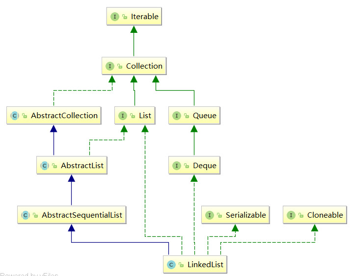

[TOC]

### 概述


1. 底层实现为链表结构，推荐使用`foreach`顺序访问，`foreach`是`iterator`的语法糖而不是for的语法糖。
2. `LinkedList`将做为双链表来实现，它本身实现了`List`接口和`Deque`接口，实现了所有可选的列表操作，并且允许包含所有元素（包括null）。
  3. `LinkedList`内部实现了6种主要的辅助方法：**`void linkFirst(E e)`、`void linkLast(E e)`、`linkBefore(E e, Node<E> succ)`、`E unlinkFist(Node<E> f)`、`E unlinkLast(Node<E> l)`           `E unlink(Node<E> x)`。**
  4. 继承结构图

   <div align="center">  </div><br>


### 数据结构

`LinkedList`底层是一个双链表，是一个直线型的链表结构。


### 源码分析


#### 继承关系


1. 继承`AbstractSequentialList`：在遍历`LinkedList`的时候，官方更推荐使用顺序访问，也就是使用我们的迭代器。官方源码对遍历进行了优化：通过判断索引index更靠近链表的头部还是尾部来选择遍历的方向

2. 实现`list`接口

3. 实现了`Cloneable`接口，它支持克隆（浅克隆），底层实现：`LinkedList`节点并没有被克隆，只是通过Object的`clone()`方法得到的`Object`对象强制转化为了`LinkedList`,然后把它内部的实例域都置空，再把被拷贝的`LinkedList`节点中的每一个值都拷贝到`clone`中。（后面有源码解析）

4. 实现了`Deque`接口，即能将`LinkedList`当作双端队列使用。

5. 实现`java.io.Serializable`接口，这意味着`LinkedList`支持序列化，能通过序列化去传输。

   

#### 内部类


真正用来存储元素的数据结构

```java
    private static class Node<E> {
        E item;
        Node<E> next;
        Node<E> prev;

        Node(Node<E> prev, E element, Node<E> next) {
            this.item = element;
            this.next = next;
            this.prev = prev;
        }
    }
```


#### 属性

```java
    /** 序列化id */
	private static final long serialVersionUID = 876323262645176354L;
	
	/** 记录LinkedList的大小，和数组类似，索引从0起，最大索引为size-1 */
	transient int size = 0;
    
	/**
     * 头节点
     * Invariant:(first==null&&last==null) ||(first.prev == null && first.item != null)
     */
    transient Node<E> first;

    /**
     * 尾节点
     * Invariant: (first==null&& last == null)||(last.next == null && last.item != null)
     */
    transient Node<E> last;
```

#### 构造器

```java
	//相比ArrayList，少一个通过设置初始化容量来初始化类的构造器，因为LinkedList底层是通过链表实现的,		//每当有新元素添加进来的时候，都是通过链接新的节点实现的，也就是说它的容量是随着元素的个数的变化而动态	//变化的。而ArrayList底层是通过数组来存储新添加的元素的    
	
	public LinkedList() {
    }

    /** 构造一个包含指定集合所有元素的list, 按照集合的迭代器返回的顺序 */
    public LinkedList(Collection<? extends E> c) {
        //先调用空构造器
        this();
        addAll(c);
    }

    /**
     * 将指定集合的所有元素添加到list的末尾，按照集合的迭代器返回的顺序，如果这个操作正在进行时，指定的集	   * 合被修改了，那么这个操作的行为是不确定的。注意：如果指定的集合是这个list并且它不为空，就会发生。
     */
    public boolean addAll(Collection<? extends E> c) {
        return addAll(size, c);
    }

    /**
     * 从list的指定位置开始，插入指定集合的所有元素。将当前位置元素(如果有)及后续元素右移。
     * 新的元素会以它在指定集合的迭代器中返回的顺序出现在list中
     *
     * 关键：确定插入的第一个节点的前驱节点。确定插入的最后一个节点的后继节点。
     * 大概思路：判断是在list末尾插入还是在list中间插入(即比较index和size)，
     * 如果在末尾插，那么原list的last就是新插入节点的前驱节点；
     * 如果在中间插，index位置节点的前驱节点就是新插入节点的前驱节点，至此基本确定了前驱节点后(即知道了往		* 哪里插)
     * 遍历数组把元素封装成节点进行插入，这时候判断前驱节点是否为空(完全确定了前驱节点。)，循环数组插入。	  * 插入完后，确定插入的最后一个节点的后继节点，又分两种情况，
     * 如果是在原list末尾插入，插入的最后一个节点就是list的last
     * 如果在原list中间插入，那么succ就是插入的最后一个节点的后继节点，同样，插入的最后一个节点是succ的	  * 前驱节点
     */
    public boolean addAll(int index, Collection<? extends E> c) {
        //判断索引是否合法
        checkPositionIndex(index);
        Object[] a = c.toArray();
        int numNew = a.length;
        if (numNew == 0)
            return false;
        //定义两个节点，succ为index位置的节点，pred为待添加到index位置节点的前驱节点
        Node<E> pred, succ;
        //如果index在list最末尾，即把c添加到原list的末尾
        if (index == size) {
            //那么index位置节点为null
            succ = null;
            //待添加节点的前驱节点就是原list的尾节点
            pred = last;
        } else {//把c添加在原list中间
            //node(index)：返回对应索引位置上的节点。
            //succ就是index位置已经存在的节点
            succ = node(index);
            //succ的前驱节点变为待添加节点的的前驱节点
            pred = succ.prev;
        }
        //进行到这里，待插入的第一个节点的前驱节点基本确定了
		//遍历数组中的每个元素
        for (Object o : a) {
            @SuppressWarnings("unchecked") E e = (E) o;
            //将每个元素封装为节点插入添加到list中
            Node<E> newNode = new Node<>(pred, e, null);
            //如果这个节点的前驱节点null，说明它没有前驱节点，那它就是list的第一个节点，它就是first
            if (pred == null)
                first = newNode;
            //进行到这里，待插入的第一个节点的前驱节点已经确定
            else
                //如果它有前驱节点，那么它就是前驱节点的后继节点
                pred.next = newNode;
            //把前驱节点设置为当前节点，以便添加后续节点
            pred = newNode;
        }
        //进行到这里，所有节点已经插入完，下面处理插入的最后一个节点的后继节点
		//如果添加在原list的末尾
        if (succ == null) {
            //那么添加完所有节点后,原list的尾节点就是添加的最后一个节点
            last = pred;
        } else {
            //如果添加在原list的中间，那么添加完所有节点后，
            //添加的最后一个节点的后继节点是succ,succ的前驱节点是添加的最后一个节点
            pred.next = succ;
            succ.prev = pred;
        }
		//list长度增加
        size += numNew;
        modCount++;//修改次数+1
        return true;
    }

	/** 判断索引是否合法 */
    private void checkPositionIndex(int index) {
        if (!isPositionIndex(index))
            throw new IndexOutOfBoundsException(outOfBoundsMsg(index));
    }

    /** 用于对一个迭代器操作或添加操作判断参数是否是一个合法的索引位置 */
    private boolean isPositionIndex(int index) {
        return index >= 0 && index <= size;
    }

    /** 返回指定索引位置的节点 */
    Node<E> node(int index) {
        //判断index是靠近前一半还是后一半
        if (index < (size >> 1)) {
            Node<E> x = first;
            for (int i = 0; i < index; i++)
                x = x.next;
            return x;
        } else {
            Node<E> x = last;
            for (int i = size - 1; i > index; i--)
                x = x.prev;
            return x;
        }
    }
```


#### 辅助方法(核心)

```java
    /** 
     * 把e作为list的first
     * 
     * 先把e封装成以first为后继节点，没有前驱节点的节点，两种情况，
     * first为null：即原list没有节点，那么e既是first又是last
     * first不为null：e作为first的前驱节点，first作为e的后继节点
     */
    private void linkFirst(E e) {
        final Node<E> f = first;
        final Node<E> newNode = new Node<>(null, e, f);
        first = newNode;
        if (f == null)
            last = newNode;
        else
            f.prev = newNode;
        size++;
        modCount++;
    }

    /**
     * 把e作为list的last
     * 
     * 先把e封装为以last为前驱节点，没有后继节点的节点，两种情况
     * last为null：即原list没有节点，那么e既是first又是last
     * last不为null：e作为last的后继节点，last作为e的前驱节点
     */
    void linkLast(E e) {
        final Node<E> l = last;
        final Node<E> newNode = new Node<>(l, e, null);
        last = newNode;
        if (l == null)
            first = newNode;
        else
            l.next = newNode;
        size++;
        modCount++;
    }

    /**
     * 将e插入到非空节点succ的前面
     * 
     * 把e封装为前驱节点为succ的前驱节点，后继节点为succ的节点newCode，succ不为null,两种情况，
     * succ前驱节点为null：那么原来的succ其实是first，现在newCode就是first
     * succ前驱节点不为null,那么前驱节点的next指向newCode，newCodenext指向succ即可
     */
    void linkBefore(E e, Node<E> succ) {
        // assert succ != null;
        final Node<E> pred = succ.prev;
        final Node<E> newNode = new Node<>(pred, e, succ);
        succ.prev = newNode;
        if (pred == null)
            first = newNode;
        else
            pred.next = newNode;
        size++;
        modCount++;
    }

    /**
     * 删除非空节点first,返回这个节点的值
     * 
     * 让f的后继节点为first，两种情况，
     * f后继节点为null：first、last都为null
     * f后继节点不为null：f后继节点的前驱节点为null
     */
    private E unlinkFirst(Node<E> f) {
        // assert f == first && f != null;
        final E element = f.item;
        final Node<E> next = f.next;
        f.item = null;
        f.next = null; // help GC
        first = next;
        if (next == null)
            last = null;
        else
            next.prev = null;
        size--;
        modCount++;
        return element;
    }

    /**
     * 删除非空last,返回这个节点的值
     * 
     * 让l的前驱节点为last,两种情况，
     * l的前驱节点为null：first、last都为null
     * l的前驱节点不为null：让l前驱节点的后继节点为null
     */
    private E unlinkLast(Node<E> l) {
        // assert l == last && l != null;
        final E element = l.item;
        final Node<E> prev = l.prev;
        l.item = null;
        l.prev = null; // help GC
        last = prev;
        if (prev == null)
            first = null;
        else
            prev.next = null;
        size--;
        modCount++;
        return element;
    }

    /**
     * 删除非空节点x,返回x的值
     * 
     * 分情况：
     * x前驱节点为null：x的后继节点为first
     * x前驱节点不为null：x的后继节点为x前驱节点的后继节点，x的前驱节点指针置为null
     * x后继节点为null：x的前驱节点为last
     * x后继节点不为null：x的前驱节点为x后继节点的前驱节点，x的后继节点指针置为null
     */
    E unlink(Node<E> x) {
        // assert x != null;
        //保存x的值
        final E element = x.item;
        //保存x的后继节点指针
        final Node<E> next = x.next;
        //保存x的前驱节点指针
        final Node<E> prev = x.prev;

        if (prev == null) {
            first = next;
        } else {
            prev.next = next;
            x.prev = null;
        }

        if (next == null) {
            last = prev;
        } else {
            next.prev = prev;
            x.next = null;
        }

        x.item = null;
        size--;
        modCount++;
        return element;
    }
```

#### 删除

```java
    /** 删除list中第一个元素并返回它的值 */
    public E removeFirst() {
        final Node<E> f = first;
        if (f == null)
            throw new NoSuchElementException();
        return unlinkFirst(f);
    }

	/** 删除list中最后一个元素并返回它的值 */
    public E removeLast() {
        final Node<E> l = last;
        if (l == null)
            throw new NoSuchElementException();
        return unlinkLast(l);
    }

    /**
     * 删除第一次在list中遇到的指定元素，如果这个元素存在。如果list中不包含这个元素，就不做任何改变。 更	 * 正式的，删除最小的索引i，使得(o==null?get(i)==null:o.equals(get(i)))，如果存在这样的元素。
     * 如果list中包含指定的元素返回true,(或者等效的，list更改为调用的结果)。
     */
    public boolean remove(Object o) {
        if (o == null) {
            for (Node<E> x = first; x != null; x = x.next) {
                if (x.item == null) {
                    //删除节点x，同上
                    unlink(x);
                    return true;
                }
            }
        } else {
            for (Node<E> x = first; x != null; x = x.next) {
                if (o.equals(x.item)) {
                    unlink(x);
                    return true;
                }
            }
        }
        return false;
    }

    /** 移除list中指定位置上的元素，将后续元素左移(即索引-1)，返回移除的元素 */
    public E remove(int index) {
        checkElementIndex(index);
        return unlink(node(index));
    }

    /** 移除list中所有的元素 */
    public void clear() {
        // Clearing all of the links between nodes is "unnecessary", but:
        // - helps a generational GC if the discarded nodes inhabit
        //   more than one generation
        // - is sure to free memory even if there is a reachable Iterator
        for (Node<E> x = first; x != null; ) {
            Node<E> next = x.next;
            x.item = null;
            x.next = null;
            x.prev = null;
            x = next;
        }
        first = last = null;
        size = 0;
        modCount++;
    }
```


#### 添加

```java
    /** 将指定元素作为list的first */
    public void addFirst(E e) {
        linkFirst(e);
    }

    /** 将指定元素作为list的last */
    public void addLast(E e) {
        linkLast(e);
    }
    /** 指定元素作为list的last */
    public boolean add(E e) {
        linkLast(e);
        return true;
    }
    /**
     * 在list的指定位置上插入指定元素。
     * 将当前位置上的元素和其后续元素移动(其实索引+1)
     */
    public void add(int index, E element) {
        checkPositionIndex(index);

        if (index == size)
            linkLast(element);
        else
            linkBefore(element, node(index));
    }
```

#### 其他

```java
    /**
     * 如果list包含指定元素就返回true
     * 更正式的,当且仅当此list包含至少1一个元素e,使得(o==null?e==null:o.equals(e)).
 	 */
    public boolean contains(Object o) {
        return indexOf(o) != -1;
    }
    /**
     * 返回list中第一次遇到指定元素的索引，如果list中不包含这个元素就返回-1,更正式的，返回最小的索引，使	  * 得(o==null?get(i)==null:o.equals(get(i)))，如果不存在这个索引，返回-1
     */
    public int indexOf(Object o) {
        int index = 0;
        if (o == null) {
            for (Node<E> x = first; x != null; x = x.next) {
                if (x.item == null)
                    return index;
                index++;
            }
        } else {
            for (Node<E> x = first; x != null; x = x.next) {
                if (o.equals(x.item))
                    return index;
                index++;
            }
        }
        return -1;
    }

    /** 返回大小 */
    public int size() {
        return size;
    }

	/** 返回list中的指定元素 */
    public E get(int index) {
        checkElementIndex(index);
        return node(index).item;
    }

    /**
     * 将list中指定位置上的元素替换为指定的元素
     *	
     * 仅仅替换节点的值
     */
    public E set(int index, E element) {
        checkElementIndex(index);
        Node<E> x = node(index);
        E oldVal = x.item;
        x.item = element;
        return oldVal;
    }

    /**
     * 返回list中最后一次遇到指定元素的索引,如果list中不包含这个元素就返回-1,更正式的,返回最大的索引i
     * 使得(o==null?get(i)==null:o.equals(get(i))),如果不存在这个索引就返回-1.
     *
     * 从尾到头遍历
     */
    public int lastIndexOf(Object o) {
        int index = size;
        if (o == null) {
            for (Node<E> x = last; x != null; x = x.prev) {
                index--;
                if (x.item == null)
                    return index;
            }
        } else {
            for (Node<E> x = last; x != null; x = x.prev) {
                index--;
                if (o.equals(x.item))
                    return index;
            }
        }
        return -1;
    }
```


#### 队列操作

```java
    /**
     * 检索但不删除first
     * 
     * first为null抛异常NoSuchElementException
     */
    public E element() {
        return getFirst();
    }

	/** 
     * 检索但不删除first
     * 
     * first为null就返回null
     */
    public E peek() {
        final Node<E> f = first;
        return (f == null) ? null : f.item;
    }

    /**
     * 移除first并返回first的值
     * 
     * first为null就返回null
     */
    public E poll() {
        final Node<E> f = first;
        return (f == null) ? null : unlinkFirst(f);
    }

    /** 将指定元素作为last */
    public boolean offer(E e) {
        return add(e);
    }

    /** 将指定元素作为first */
    public boolean offerFirst(E e) {
        addFirst(e);
        return true;
    }

    /** 将指定元素作为last */
    public boolean offerLast(E e) {
        addLast(e);
        return true;
    }

    /** 检索但不删除first,如果list为空返回null */
    public E peekFirst() {
        final Node<E> f = first;
        return (f == null) ? null : f.item;
     }

    /** 检索但不删除last,如果list为空返回null */
    public E peekLast() {
        final Node<E> l = last;
        return (l == null) ? null : l.item;
    }

    /** 检索并删除first,如果list为null,返回null */
    public E pollFirst() {
        final Node<E> f = first;
        return (f == null) ? null : unlinkFirst(f);
    }

    /** 检索并删除last,如果last为null，返回null */
    public E pollLast() {
        final Node<E> l = last;
        return (l == null) ? null : unlinkLast(l);
    }

    /** 将元素推送到list表示的堆栈上，换句话说，在列表的前面插入插入元素 */
    public void push(E e) {
        addFirst(e);
    }

    /** 从list所代表的堆栈上出队一个元素，换句话说，返回并删除last */
    public E pop() {
        return removeFirst();
    }

    /** 移除list中第一次遇到的指定元素(从头到尾遍历).如果list中不包含这个元素list就不发生改变 */
    public boolean removeFirstOccurrence(Object o) {
        return remove(o);
    }

    /** 移除list中最后一次遇到的指定元素(从头到尾遍历).如果list中不包含这个元素list就不发生改变 */
    public boolean removeLastOccurrence(Object o) {
        if (o == null) {
            for (Node<E> x = last; x != null; x = x.prev) {
                if (x.item == null) {
                    unlink(x);
                    return true;
                }
            }
        } else {
            for (Node<E> x = last; x != null; x = x.prev) {
                if (o.equals(x.item)) {
                    unlink(x);
                    return true;
                }
            }
        }
        return false;
    }
```

#### 其他方法

```java
	/** 调用Object类的克隆方法，强转为LinkedList类型 */
    @SuppressWarnings("unchecked")
    private LinkedList<E> superClone() {
        try {
            return (LinkedList<E>) super.clone();
        } catch (CloneNotSupportedException e) {
            throw new InternalError(e);
        }
    }

    /** 浅克隆 */
    public Object clone() {
        LinkedList<E> clone = superClone();

        // Put clone into "virgin" state
        clone.first = clone.last = null;
        clone.size = 0;
        clone.modCount = 0;

        // Initialize clone with our elements
        for (Node<E> x = first; x != null; x = x.next)
            clone.add(x.item);
        return clone;
    }

    /**
     * 返回包含list中所有元素的数组，顺序为从first到last.
     *
     * 返回的数组是安全的，因为list不保留对它的引用(换句话说，这个list必须分配一个新数组。)。因此，调用	 * 者可以自由修改这个数组。
     *
     * 这个方法充当基于数组与基于集合API之间的桥梁。
     */
    public Object[] toArray() {
        Object[] result = new Object[size];
        int i = 0;
        for (Node<E> x = first; x != null; x = x.next)
            result[i++] = x.item;
        return result;
    }

    /**
     * 返回包含list中所有元素的数组，顺序为从first到last。返回的数组的运行时类型是指定数组的运行时类	 * 型。如果list适合指定的数组，它将返回。否则, 将以指定数组的运行时类型分配一个list大小的新数组
     * 
     * 如果指定的数组比list空间大，那么数组中紧跟在list后面的元素就置为null。(这仅在调用者知道list不包		* 含空元素确定list长度时有用)
     *
     * 像toArray()方法, 这个方法充当基于数组与基于集合API之间的桥梁。进一步的，这个方法允许精确的控制输	   * 出数组的运行时类型, 在某些情况下，可用于节省分配的成本。
     *
     * 假定x是一个已知只包含字符串的list,下面的代码可以将list转换为一个新分配的字符如数组。
     *		String[] y = x.toArray(new String[0]);
     * 注意toArra y(new Object[0])与toArray()在功能上是一样的。
     */
    @SuppressWarnings("unchecked")
    public <T> T[] toArray(T[] a) {
        //如果参数数组长度<list大小
        if (a.length < size)
            //通过反射，创建一个与list一样大的数组，然后返回这个新创建的数组,此时数组中的元素一定是list			   //中全部节点的item
            a = (T[])java.lang.reflect.Array.newInstance(
                                a.getClass().getComponentType(), size);
        int i = 0; 
        Object[] result = a;
        for (Node<E> x = first; x != null; x = x.next)
            result[i++] = x.item;
		//如果参数数组长度>list大小
        if (a.length > size)
            //把a[size]置为空,返回a,此时数组中，[0,size-1]存放list中全部节点的item,a[size]为				//null,a[size+1,a.length-1]不变，即原来放的什么元素先就放什么元素
            a[size] = null;
        return a;
    }
```


