### AVL树

- 具有二叉查找树的全部特性
- 每个节点的左右子树高度差至多为1（避免大量节点偏向于一边的情况）

### 红黑树

- 查找、插入操作的时间复杂度是`O(lgn)`，（**二叉树最大查找次数等于树的深度）**
- 红黑树需要进行左旋，右旋操作， 链表不需要
- 链表插入/删除头节点是O(1)，其他是O(n)，查找是O(n)
- 用处：TreeSet/TreeMap；Hashmap；C++的STL

### 性质

1. 每个节点要么是**黑色**，要么是**红色**

2. **根**节点是**黑色**

3. 每个**叶子结点(NIL)是黑色**

4. 每个**红色节点的两个子节点**一定都是**黑色**

5. 任意一节点到每个叶子节点的路径都包含**数量相同的黑节点**，俗称：黑高。

6. 性质5推论：如果一个节点存在黑子节点，那么该节点肯定有两个子节点

   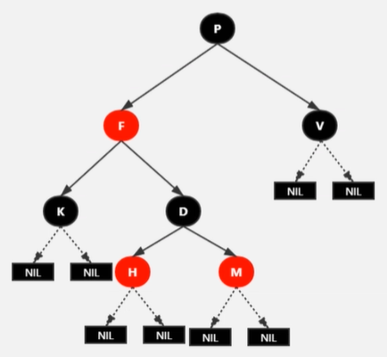

- 红黑树不是完美平衡的二叉查找树，如上图，P的左子树显然比右子树高。但左右子树黑节点层数是相等的。所以红黑树是**黑色完美平衡**。

### 自平衡

- 三种操作保持平衡：左旋、右旋、变色

#### 左旋

- 以某个节点作为支点(旋转节点)，其右子节点变为旋转节点的父节点，右子节点的左子节点变为旋转节点的右子节点，左子节点保持不变
- 

- 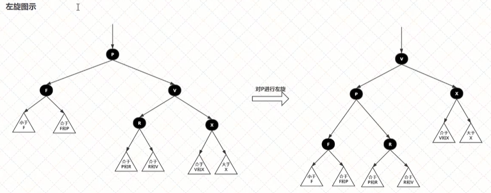

#### 右旋

- 以某个节点作为支点(旋转节点)，其左子节点变为旋转节点的父节点，左子节点的右子节点变为旋转节点的左子节点，右子节点保持不变
- 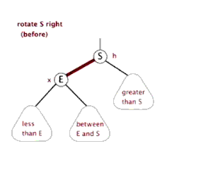

- 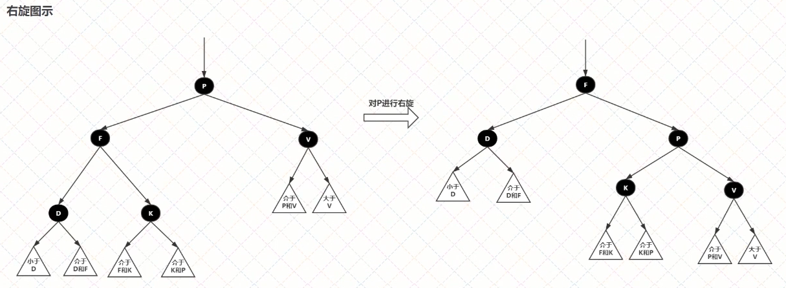

#### 变色

- 节点颜色由红变黑或者由黑变红

### 插入

- 步骤
  1. 查找插入的位置
  2. 自平衡

- **插入节点必须为红色**

  - 如果插入节点是红色，当插入节点的父节点为黑色时，树的黑色平衡没有被破坏，不需要自平衡
  - 如果插入节点是黑色，那么插入位置所在子树黑色节点总数多1，必须自平衡。

- 如图定义树的节点

  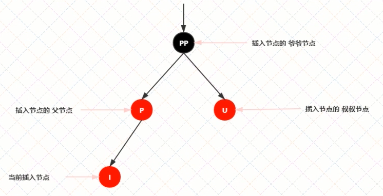

#### 情景1：红黑树为空树

- 直接把插入节点作为根节点就行
- 根节点必须是黑色

#### 情景二：插入节点的Key已存在

- 更新当前节点的值为插入节点的值

  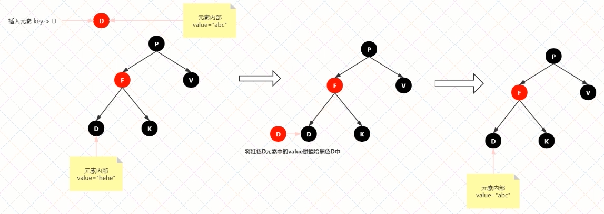

#### 情景三：插入节点的父节点是黑色节点

- 由于插入的节点是红色节点，当其父节点是黑色节点时，并不会影响平衡性，直接插入即可

  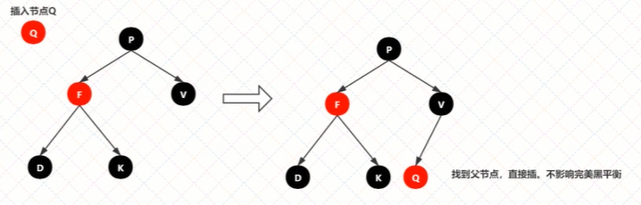

#### 情景四：插入节点的父节点是红色节点

- 根据性质2：根节点是黑色节点。所以如果插入节点的父节点是红色，那么该父节点不可能为根节点，所以该节点存在祖父节点

- 存在两种情况：叔叔节点存在并且为红；叔叔节点不存在或为黑色

  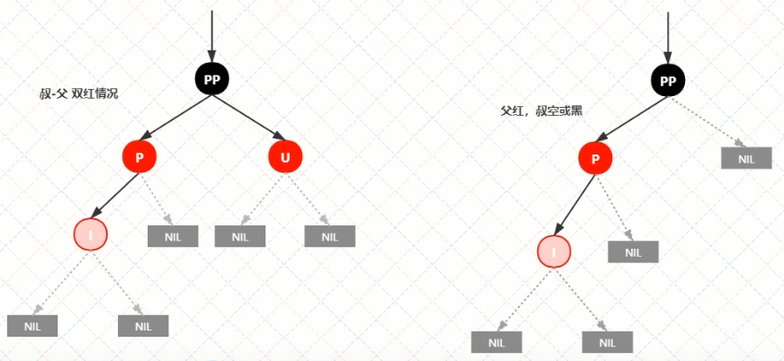

##### 情景4.1：叔叔节点存在并且为红

- 根据性质4：红色节点不能相连，所以祖父节点一定是黑色

- 因为不能存在两个相连的红节点，此时情况是黑红红，所以最简单处理方式是变为红黑红

  1. 将P和U节点改为黑色
  2. 节PP改为红色
  3. 将PP设置为当前节点，进行后续处理

  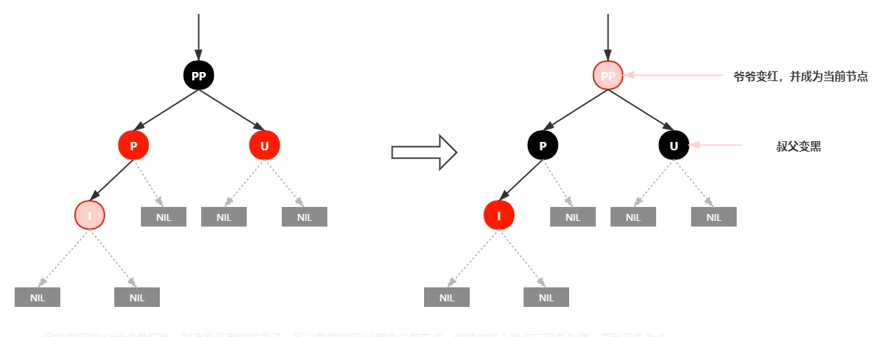

- 可以看到，将PP节点设为红色后，如果PP节点的父节点是黑色，那么无需任何处理；如果是红色，那么需要将PP设为当前节点，继续做插入操作自平衡处理，直到平衡

##### 情景4.2：叔叔节点不存在或为黑色节点时，并且插入节点的父节点是祖父节点的左子节点

- 注意：单纯从插入前来看，叔叔节点非红即空，否则破坏性质5

- 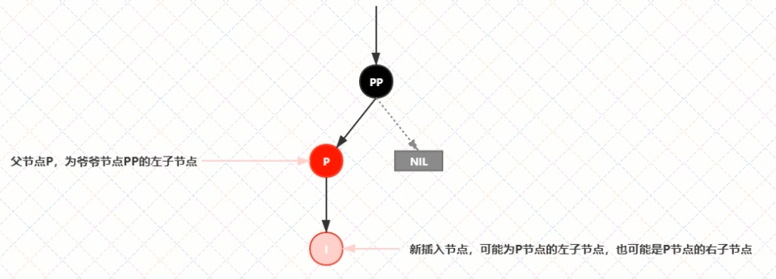

###### 情景4.2.1：新插入节点为其父节点的左子节点

- 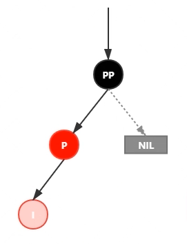

- 处理

  1. 变颜色：将P设为黑色，将PP设为红色
  2. 对PP节点进行右旋

  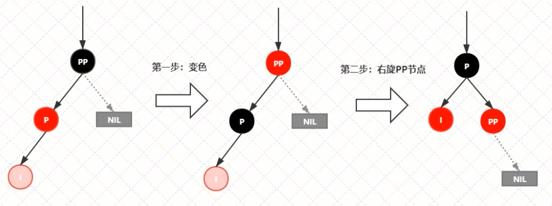

###### 情景4.2.2：新插入节点为其父节点的右子节点

- 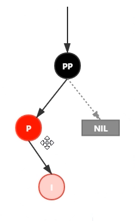

- 处理

  1. 将P进行左旋
  2. 将P设置为当前节点，得到 情景4.2.1

  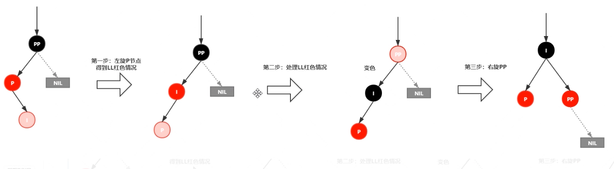

##### 情景4.3：叔叔节点不存在或为黑色节点时，并且插入节点的父节点是祖父节点的右子节点

- 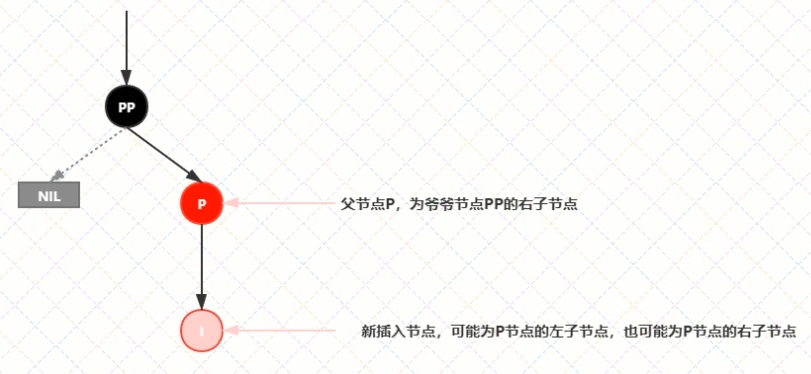

###### 情景4.3.1：新插入节点为其父节点的右子节点

- 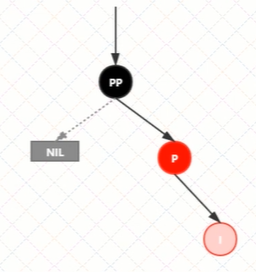

- 处理

  1. 边夜色：将P设为黑色，将PP设为红色
  2. 将PP进行左旋

  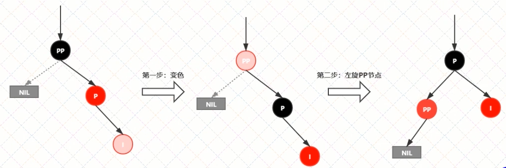

###### 情景4.3.2：新插入节点为其父节点的左子节点

- 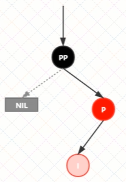

- 处理

  1. 对P进行右旋
  2. 将P设为当前节点，得到 情景4.3.1
  3. 按照情景4.3.1进行处理(1.变颜色；2.左旋PP)

  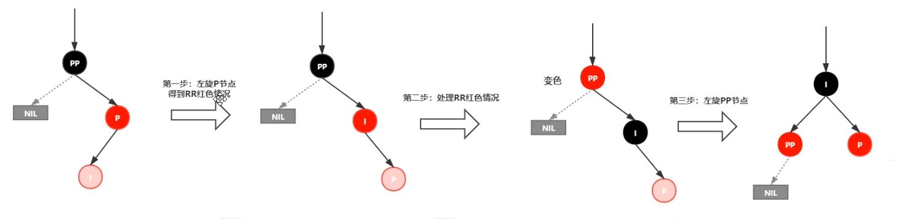

